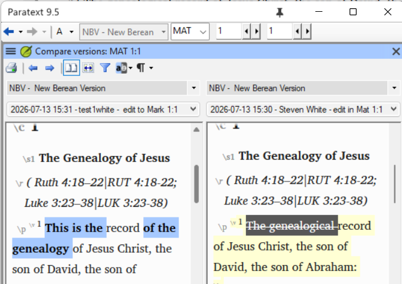
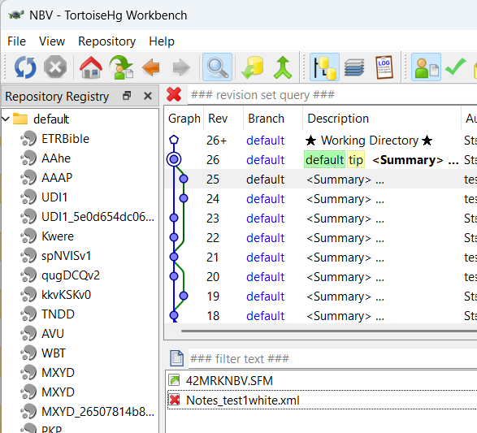
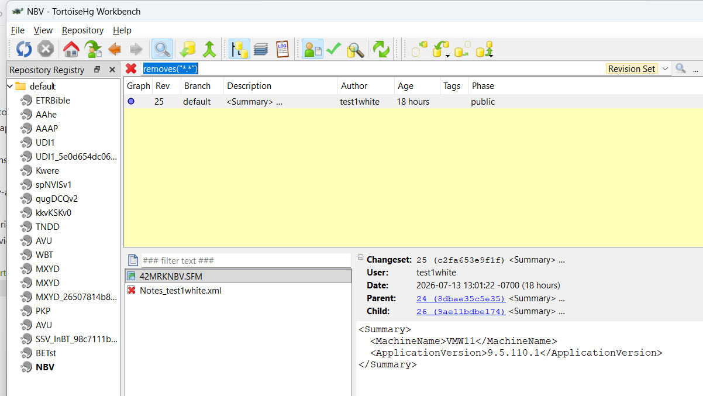
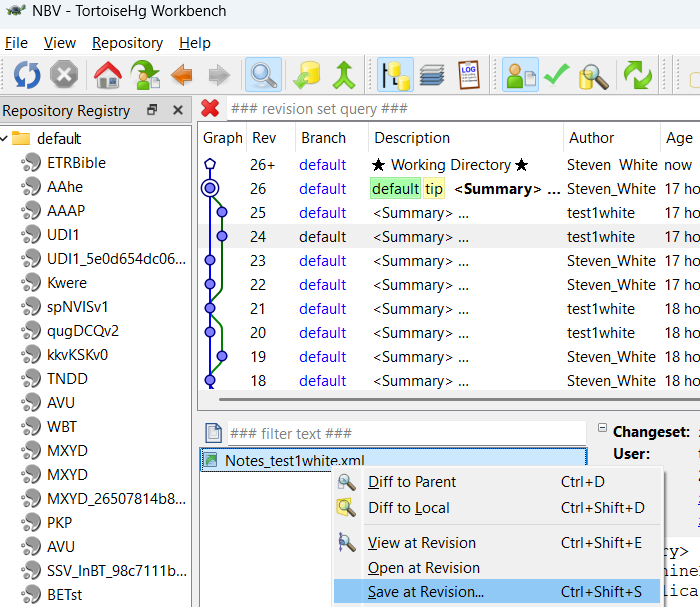
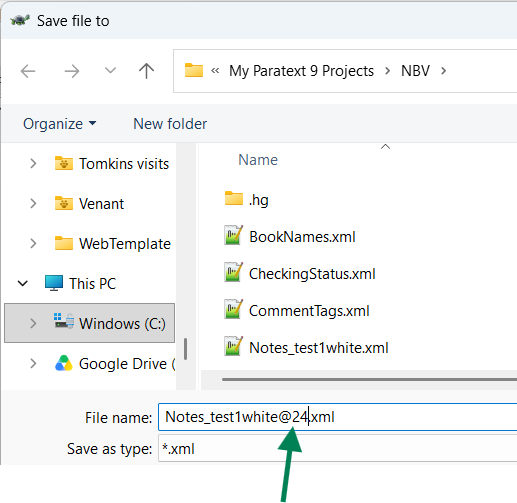

# Course Design Document

## Course overview

| Item | Description |
| --- | --- |
| **Title** | Advanced Paratext Support |
| **Competencies addressed** | Translation Tools |
| **Target outcome level** | With Assistance |
| **SME(s) consulted** | TBD — scenario list below was supplied directly by the requesting consultant during initial scoping; a full SME interview for procedural specifics has not yet been conducted (see SME knowledge notes below) |
| **Design status** | Approved by Steve White on 2026-07-16 |

### Outcome-level rationale

This course sits above the two existing Paratext modules — `paratext-9-basic-training-course`
(basic navigation) and `paratext-quotation-rules` (intermediate configuration) — both at
`target_outcome_level: With Assistance`. This repo's module frontmatter uses a two-value
outcome scale (`Has knowledge` / `With Assistance`), which is coarser than the Translation
Tools competency's five-rung activity ladder (Learner / Advanced Beginner / Practitioner /
Trainer-Proficient / Expert). Matching this course's scope against that ladder, the closest
rows are consistently at **Practitioner**: 5.0 Scripture Collaboration Practitioner
("Advise users in best-practices for collaboration and data safety … such as the use of
Send/Receive. Assist users to configure plans and tasks in a way that helps them.") and 3.0
Scripture Markup and Import Practitioner ("Convert and import data from other formats …
into translation software."). Practitioner-level activity is still "perform/configure with
some independent judgment," not "train others" (Trainer/Proficient) or "train consultants"
(Expert), so on the repo's binary scale it lands as **With Assistance**, one notch of
difficulty above the two prerequisite courses within that same band — the learner performs
real recovery procedures, but is not yet expected to train other consultants to do so.

### Scope note

All five SME-specified scenarios fit coherently within one module: each is a discrete
Paratext support/recovery procedure, none independently justifies 90 minutes of content,
and the combined learner seat time (see Module breakdown) comes in under the 270-minute
guideline. Recommendation: **keep as one module**, not split. If future SME interview
uncovers that any single topic (most likely the notes/settings-recovery scenario, which
involves an external tool — TortoiseHG/Mercurial — and manual file editing, and is already
the longest single topic) needs substantially more room, revisit the split decision then
rather than pre-emptively.

## Learning objectives

| # | Objective | Source | Assessed by |
| --- | --- | --- | --- |
| 1 | Learner can install an openly-licensed/open-source Scripture text as a readable (resource) project in Paratext, distinct from the team's own translation draft project. | Translation Tools, 3.0 — Scripture Markup and Import, Practitioner ("Convert and import data from other formats (plain text, Word document, etc) into translation software.") | Scenario Bank #1 |
| 2 | Learner can diagnose why Paratext's chronological project-history view does not always reflect the true order of edits, and determine the actual sequence of changes using the tools available. | Translation Tools, 5.0 — Scripture Collaboration, Practitioner ("Advise users in best-practices for collaboration and data safety … such as the use of Send/Receive.") — approximate match; the descriptor names Send/Receive and data safety generally but does not specifically call out history-view accuracy. Closest existing row. | Scenario Bank #2; Quiz |
| 3 | Learner can explain why Paratext's per-book user-role edit restrictions are not an absolute guarantee — that a book file can be altered outside Paratext (crashes, file-system corruption, an external history restore) and that change will propagate to the whole team via Send/Receive — and can apply the correct response (delete-project-and-resync, not an immediate Send/Receive) when a user's local files may be corrupted. | Translation Tools, 5.0 — Scripture Collaboration, Practitioner ("Advise users in best-practices for collaboration and data safety … such as the use of Send/Receive.") — approximate match; the descriptor's general data-safety language covers this failure mode without naming it specifically. | Scenario Bank #3; Quiz |
| 4 | Learner can recover a previous version of project notes, term renderings, or other non-text project settings that are not restored by a plain text rollback. | Translation Tools, 5.0 — Scripture Collaboration, Practitioner ("Advise users in best-practices for collaboration and data safety … such as the use of Send/Receive.") — **flagged: no clean match.** The descriptor's data-safety language does not enumerate recovery of notes/renderings/non-text settings specifically; this is the closest existing row, included because the SME named it as a real, recurring support case. | Scenario Bank #4; Quiz |
| 5 | Learner can configure a reference project that preserves ("snapshots") the translation text as it existed at an earlier stage of the project. | Translation Tools, 5.0 — Scripture Collaboration, Practitioner ("Advise users in best-practices for collaboration and data safety … such as the use of Send/Receive. Assist users to configure plans and tasks in a way that helps them.") | Scenario Bank #5; Quiz |

## Module breakdown

| File | Topic | Objectives covered | Estimated minutes |
| --- | --- | --- | --- |
| `01-installing-open-source-texts.md` | Installing an open-source/openly-licensed text as a readable resource project | 1 | 35 |
| `02-project-history-accuracy.md` | Understanding and troubleshooting Paratext's chronological project-history view | 2 | 40 |
| `03-user-roles-and-edit-access.md` | Why Paratext's per-book edit-role restrictions aren't foolproof, and the safe recovery response when a user's local files may be corrupted | 3 | 30 |
| `04-recovering-notes-and-settings.md` | Recovering previous versions of project notes, term renderings, and other non-text settings | 4 | 40 |
| `05-snapshotting-to-a-reference-project.md` | Saving an earlier text state into a reference project | 5 | 30 |
| `06-scenario-bank.md` | Applied practice: five "here's a broken/at-risk project — fix it" recovery scenarios, one per topic, sequenced simplest (resource install) → most complex (notes/settings recovery via TortoiseHG) | 1, 2, 3, 4, 5 | 80 |
| `07-mentor-guide.md` | Facilitator notes: rubric for grading each scenario, what a complete recovery looks like, common wrong turns | — | — |
| `08-quiz.md` | Assessment | 1, 2, 3, 4, 5 | 20 (not counted — see below) |
| **Total learner seat time** | | | **255** |

Lesson content totals 175 minutes (35+40+30+40+30); the scenario bank adds 80 minutes for a
total of 255 learner-facing minutes — under the 270-minute guideline, with the scenario
bank deliberately weighted at roughly a third of total time, since these five topics are
exactly the "diagnose and fix a real project problem" cases this course exists to build.
Mentor guide and quiz minutes are structural/facilitator or assessment-only and are excluded
from the seat-time total per convention.

## Assessment plan

A 10-question multiple-choice quiz (80% = 8/10 to pass) covers conceptual and diagnostic
knowledge for all five objectives (two questions per topic) — recognizing correct vs.
incorrect approaches, predicting what a given history/backup state implies, and identifying
the right Paratext feature for a described symptom. The five-scenario bank is where
hands-on performance is verified for all five objectives — each scenario presents a project
in a broken or at-risk state and is graded holistically by a mentor against the mentor
guide's rubric, not auto-scored, since a multiple-choice question cannot confirm a learner
actually executed a recovery procedure correctly.

## SME knowledge notes

The following five scenarios were supplied directly by the requesting consultant (SME) as
the exact real-world support cases this course must prepare a consultant for. They are
recorded here verbatim as given, before any deeper interview:

1. Installing an open-source text as a readable project (in Paratext).
2. The chronological view of project history is not always accurate — troubleshooting/
   understanding this.
3. Paratext user roles limiting editing access are not foolproof
4. Recovering previous versions of project notes, term renderings, and other non-text
   settings in a project (not just the text itself).
5. Saving into a reference project the text as it was at an earlier stage (i.e.,
   snapshotting/archiving prior text state into a reference project).

**SME interview — status as of 2026-07-16:** The SME has now supplied exact procedures,
war stories, common failure points, Paratext version notes, and "what good looks like"
criteria for all five scenarios below (see verbatim notes per scenario). All five now carry
a stated Paratext version scope and success criterion; the earlier gaps in Scenarios 3 and 5
(missing version scope, missing "what good looks like", and for Scenario 5, missing failure
points) have been filled by the SME and are reflected in the lesson content, scenario bank,
and mentor guide.
##**Scenario 1:**
**Exact procedures for scenario:** Paratext resources are never editable, even if the text in question is open source or public domain. You need to find a way outside of Paratext to download the text you want in USFM format.
Some places you can look for USFM format downloads:
a) ebible.org/find
b) open.bible/bibles---
When you download the text in USFM format, you can create a new project in Paratext (main menu - New Project), specify the language in project properties and set project type to a standard translation, then you can import the books(Project menu - Manage books - Import books) from your download into the project.
**Paratext version differences** This applies to any Paratext 9 version, and the principles apply to earlier Paratext versions
**Common failure points** Users may be puzzled when they download a resource like the Berean Standard Bible that they cannot edit the text, since the BSB text is public domain.
**War stories** A translation team may wish to have an editable text they can practice editing on, and practice other aspects of using Paratext. A training workshop may benefit by being able to have all participants able to edit the same text.
**What "good" looks like**
Users should be able to download a public domain or open source text, and import it into a project in Paratext.
##**Scenario 2:**
**War stories** Someone viewing the project history may be alarmed at what appears to be an instance of an edit in one book reversing an edit in a different book. For instance, in a test project, one user does this edit at the beginning of Matthew: then marks a point in project history
A second user does this edit at the beginning of Mark  then marks a point in Project history

after both send/receive the project history looks like this:

If someone does a compare versions of Matthew comparing the history point when Mark was edited, and the history point that Matthew was edited, the edit of Matthew appears to have been undone.  This is an illusion, because history points in a repository are not always in strict chronological order.
I once saw a project where one user's computer clock was set to the wrong date, several months in the future. Mercurial was not fooled by the bad date, but kept track how this user made an edit, sent it to the server and other users made edits afterwards. It knew that despite  the erroneous date, this user's work was not the most "recent" version. 
**Exact procedures for scenario**
This is not strictly speaking a scenario but a point to be aware of. The Mercurial software that manages the repository and displays project history and merges changes together as users send and receive each others changes does not always track by chronology, but it tracks by version number. When the project is created, that makes version #1. If the first user makes an edit or changes something that makes version #2, a further edit or change makes version #3. What happens when there are multiple users and they each make an edit? For instance, in our example each user had version #18. The first user edits Matthew, making version #19. The second user edits Mark, also making a version #19. When they both send/receive, Mercurial says "we can't have two different versions #19", and it picks one of those to be version #19, and the other one becomes version #20 and when the two merge, that is version #21. But the numerical progression of version numbers may not be strictly chronological. 
**Common failure points** What I described in the war story above, someone looks at project history and thinks an edit got undone. 
**Paratext version differences** This issue is relevant to Paratext 9, and to any previous version that used Mercurial repositories, going all the way  back to Paratext 7. 
**What "good" looks like** A user is able to explain how and why the chronological presentation of project history in Paratext is not always accurate. 
##**Scenario 3**
**War stories** Sometimes the project history may show a change by someone who does not have edit access to that book. Users may wonder how this could have happened. 
**Exact understanding** Paratext will not let you edit a text that you do not have editing access to. But some computer mishaps, or even manual editing of a file outside of Paratext can result in project changes which are credited to a user without editing access to a book. If a book file has been changed outside of Paratext, Paratext will send the changed version to the repository via send/receive. The one exception to this is for project observers, if their text changes, those changes are not sent by Paratext. 
Some computer mishaps that can result in changing Paratext files: Hard drive corruption, file system errors, Paratext crashing without closing normally, or the computer crashing without closing normally. Another one, if a project uses the .ptx file extension for their book files, and someone on the project does a Windows restore from history procedure to resolve a computer problem, the Paratext book files will be reverted to the date of that history point. (Windows restore is not supposed to modify user data, only system files, but Microsoft considers the .ptx extension a system file)  
This is why if a user experiences a computer crash, or file system errors so that project files disappear, they should not do a send/receive right away. That send/receive may send their corrupted files to other users. What they should do in this case is to delete the project from their Paratext with "Delete project", then do a send/receive to receive a new copy from the server.
**Paratext version differences** Version 9, and also 8 and 7.
**What "good" looks like** A user can explain cases where the project history shows aa mysterious edit by someone without editing permission.
##**Scenario 4**
**War stories** A user asks for help because a bunch of project notes have gone missing, perhaps every single note a user has submitted, or perhaps lots of older notes have vanished, only the very latest ones are visible. Computer mishaps such as Paratext crashing without shutting down properly,  or the computer crashes while Paratext was running, can cause a user's note file, or the list of term renderings, or the project wordlist to be deleted, and then these changes can get propagated to all the project users by send/receive. 
**Exact procedures for scenario**
Mercurial keeps a detailed record of changes to the notes files and other project settings just like it does for the project text. But the Paratext project history does not show these details. You need to have a way to connect to Mercurial more directly than through Paratext to look for these. You can do this either by downloading the TortoiseHG tool, or by running Mercurial commands directly in a command prompt. 
Downloading TortoiseHG: Go to https://tortoisehg.bitbucket.io/download/index.html and download the latest version for 64 bit Windows. (If you do have 32 bit Windows, you would download that version. All Windows 11 versions are 64 bit, some Windows 10 or earlier versions were 32 bit. You can verify which kind you have by looking up the Windows version info in Windows settings)
To find where a file was deleted in the project, close Paratext, and in Tortoise HG bring up the HG workbench. (In File Viewer, right click on the project folder, choose "show more options" then pick HG Workbench in the Tortoise HG section)
If you know the file was recently deleted, you can find it by inspecting the recent history points. For instance in this example, one user's note file was deleted. . 
If you cannot find it, search for a file deletion by typing **removes("*.*")** in the revision set query box. If the revision set query box is not visible, click in the list of revisions and press Ctrl-S
To recover the deleted file, go to the history point just before the file was deleted, right click on the file and choose "save at revision" 
  
The save dialog will suggest adding @ followed by the version number to the file you save, in this example you want to delete those characters to save as the original file name. Now you can restart Paratext, see the missing notes, and do a send/receive to circulate the notes to other project users.

In the case where the user has some recent notes visible, but older notes were lost, this probably means the file was deleted a while ago, and then the user created some new notes. How can you merge an old notes file with a new one? As above, close Paratext if it is open.
1) find the deleted file and save from the previous revision as above. In this case though, keep the @NN at the end of the filename, otherwise you would replace the new notes file, losing the new notes.
2) edit the new file in Notepad (or another text editor) and delete the first two lines, that read 
**<?xml version="1.0" encoding="utf-8"?>
<CommentList>**
3) open the old file and delete the last line, that reads
**</CommentList>**
4) select all the old file, then paste it above the contents of the new file, and save your changes. 
Now start Paratext.

Paratext should now show all the notes. If Paratext says the notes file is corrupt, you did something wrong in the edit.
Open the corrupt notes file (Paratext will rename it **Notes_User Name.corrupt**) and check for:
1. the first line is **<?xml version="1.0" encoding="utf-8"?>** (and that line occurs nowhere else in the file)
2. the second line is **<CommentList>** (and that occurs nowhere else in the file)
3. the last line is **</CommentList>** (and that line occurs nowhere else in the file) The last line differs from the second line because there is a **/** between **<** and **CommentList>**
**Paratext version differences** Applies to 9, also 8. 
##**Scenario 5**
**War Stories** The compare version tool will let you compare your current text with a previous point in history. It makes sense for users to mark significant milestones in their project with the "Mark point in history" command, so that these stages can be easily found. But some teams may wish to have the text from an earlier stage as another project, so they could make printouts of it, or add it to a text collection window. 
**Exact procedure**
1) If the team is currently at the point that they want to save for reference, this is fairly easy. They can create a new project, and copy or import the books into it (Main menu, new project). After creating the new project, open the project menu, choose Manage Books > Import books, and select the book files from the main project.
2) If the project administrator wants to create a separate project from an earlier point in history, it is possible to revert all the books to the desired point, then import them into the new project, then delete the reverted copy of the main project and get a fresh copy by doing send/receive.
Step by step:
1) Do send/receive if you have made any recent changes that have not yet been sent.
2) make sure all automatic send/receive options are turned off for the main project 
3) In project history, select the desired history point, use the "Revert books" command and select the books to revert.
4) create the new project and import the books as above.
5) delete the reverted main project. Choose "delete project" (from either the main menu or the project menu), select action "Delete from this computer only"
6) Do send/receive, select the main project from your list of "New" projects, to restore the current version. Now you can turn any automatic send/receive options back on if you were using them. 
**Paratext versions** Paratext 9
**What could go wrong** A send receive of the reverted project (between step 3 and step 5) could reintroduce older work as "new" work. 
**What good looks like** User can create a second project with content from an earlier stage of a project's history. 
## Handoff

- **Learning objectives:** 5, one per SME-specified scenario, drawn from the Translation
  Tools competency descriptor's Practitioner-level rows under 3.0 Scripture Markup and
  Import and 5.0 Scripture Collaboration. Objective 4 (recovering notes/renderings) is
  explicitly flagged as not cleanly matching any existing activity-ladder row — it is
  included anyway because the SME named it by name as a real, recurring support case. (An
  earlier draft of this table included a sixth, unrelated objective — restoring admin
  access to a project with no available administrator — that had no SME content behind it
  at all and did not appear in the SME's own scenario list; it has been dropped in favor of
  the SME's actual scenario 3, "user roles are not foolproof.")
- **Modules:** 5 numbered lesson files (35+40+30+40+30 = 175 minutes), each well under the
  90-minute cap, plus an 80-minute scenario bank, a mentor guide, and a quiz (mentor guide
  and quiz excluded from seat-time total per convention).
- **Total learner seat time:** 255 minutes (within the ≤270-minute ceiling), with the
  scenario bank intentionally weighted heavy given the recovery/troubleshooting nature of
  this content.
- **Module count recommendation:** One module, not split — see Scope note above.

This document is the **contract** for `module-author` and `quiz-writer`: they will draft
only the modules, objectives, and assessments specified above — not freelance additional
topics or competencies.
