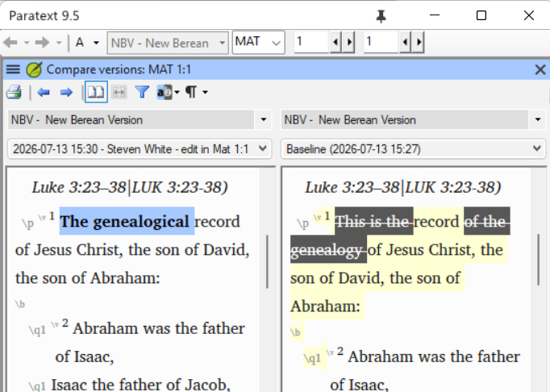
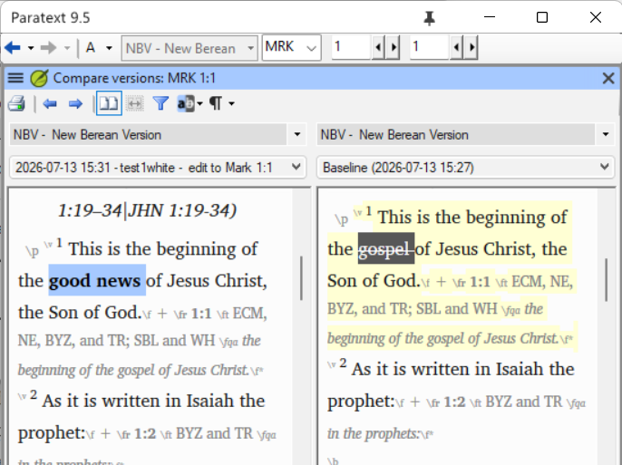
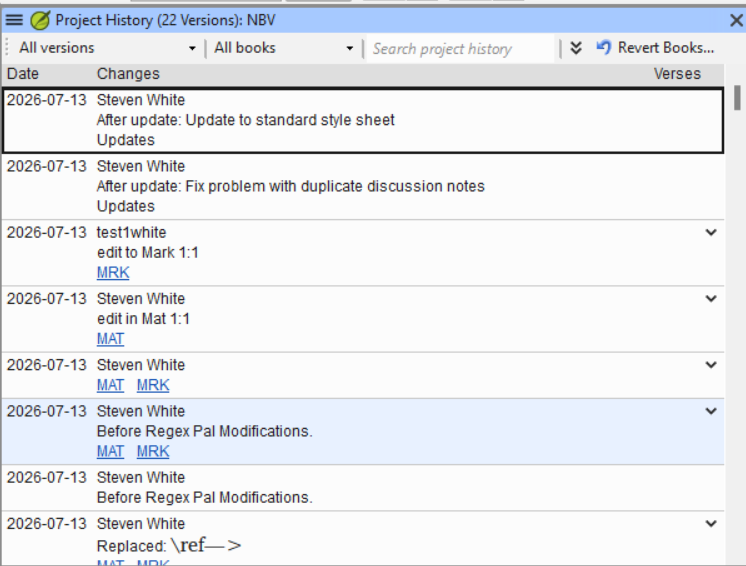

# Course Design Document

## Course overview

| Item | Description |
| --- | --- |
| **Title** | Advanced Paratext Support |
| **Competencies addressed** | Translation Tools |
| **Target outcome level** | With Assistance |
| **SME(s) consulted** | TBD — scenario list below was supplied directly by the requesting consultant during initial scoping; a full SME interview for procedural specifics has not yet been conducted (see SME knowledge notes below) |
| **Design status** | Draft |

### Outcome-level rationale

This course sits above the two existing Paratext modules — `paratext-9-basic-training-course`
(basic navigation) and `paratext-quotation-rules` (intermediate configuration) — both at
`target_outcome_level: With Assistance`. This repo's module frontmatter uses a two-value
outcome scale (`Has knowledge` / `With Assistance`), which is coarser than the Translation
Tools competency's five-rung activity ladder (Learner / Advanced Beginner / Practitioner /
Trainer-Proficient / Expert). Matching this course's scope against that ladder, the closest
rows are consistently at **Practitioner**: 5.0 Scripture Collaboration Practitioner
("Advise users in best-practices for collaboration and data safety … such as the use of
Send/Receive. Assist users to configure plans and tasks in a way that helps them.") and 3.0
Scripture Markup and Import Practitioner ("Convert and import data from other formats …
into translation software."). Practitioner-level activity is still "perform/configure with
some independent judgment," not "train others" (Trainer/Proficient) or "train consultants"
(Expert), so on the repo's binary scale it lands as **With Assistance**, one notch of
difficulty above the two prerequisite courses within that same band — the learner performs
real recovery procedures, but is not yet expected to train other consultants to do so.

### Scope note

All five SME-specified scenarios fit coherently within one module: each is a discrete
Paratext support/recovery procedure, none independently justifies 90 minutes of content,
and the combined learner seat time (see Module breakdown) comes in under the 270-minute
guideline. Recommendation: **keep as one module**, not split. If future SME interview
uncovers that any single topic (most likely the admin-access-recovery scenario, which may
involve organization-specific Paratext Registry/Send-Receive-server administration steps)
needs substantially more room, revisit the split decision then rather than pre-emptively.

## Learning objectives

| # | Objective | Source | Assessed by |
| --- | --- | --- | --- |
| 1 | Learner can install an openly-licensed/open-source Scripture text as a readable (resource) project in Paratext, distinct from the team's own translation draft project. | Translation Tools, 3.0 — Scripture Markup and Import, Practitioner ("Convert and import data from other formats (plain text, Word document, etc) into translation software.") | Scenario Bank #1 |
| 2 | Learner can diagnose why Paratext's chronological project-history view does not always reflect the true order of edits, and determine the actual sequence of changes using the tools available. | Translation Tools, 5.0 — Scripture Collaboration, Practitioner ("Advise users in best-practices for collaboration and data safety … such as the use of Send/Receive.") — approximate match; the descriptor names Send/Receive and data safety generally but does not specifically call out history-view accuracy. Closest existing row. | Scenario Bank #2; Quiz |
| 3 | Learner can recover a previous version of project notes, term renderings, or other non-text project settings that are not restored by a plain text rollback. | Translation Tools, 5.0 — Scripture Collaboration, Practitioner ("Advise users in best-practices for collaboration and data safety … such as the use of Send/Receive.") — **flagged: no clean match.** The descriptor's data-safety language does not enumerate recovery of notes/renderings/non-text settings specifically; this is the closest existing row, included because the SME named it as a real, recurring support case. | Scenario Bank #3; Quiz |
| 4 | Learner can configure a reference project that preserves ("snapshots") the translation text as it existed at an earlier stage of the project. | Translation Tools, 5.0 — Scripture Collaboration, Practitioner ("Advise users in best-practices for collaboration and data safety … such as the use of Send/Receive. Assist users to configure plans and tasks in a way that helps them.") | Scenario Bank #4; Quiz |
| 5 | Learner can restore administrative access to a back translation project when the registered administrator is unavailable, has left the organization, or is incapacitated. | Translation Tools — **flagged: no matching activity-ladder row at any level.** Closest is 5.0 Scripture Collaboration's general data-safety language, but admin-continuity/registry-access recovery is not addressed by any row in the descriptor. Included because the SME named it as a real, recurring support case that this course must cover by name. | Scenario Bank #5 |

## Module breakdown

| File | Topic | Objectives covered | Estimated minutes |
| --- | --- | --- | --- |
| `01-installing-open-source-texts.md` | Installing an open-source/openly-licensed text as a readable resource project | 1 | 35 |
| `02-project-history-accuracy.md` | Understanding and troubleshooting Paratext's chronological project-history view | 2 | 40 |
| `03-recovering-notes-and-settings.md` | Recovering previous versions of project notes, term renderings, and other non-text settings | 3 | 40 |
| `04-snapshotting-to-a-reference-project.md` | Saving an earlier text state into a reference project | 4 | 30 |
| `05-recovering-admin-access.md` | Regaining access to a back translation project with no available administrator | 5 | 30 |
| `06-scenario-bank.md` | Applied practice: five "here's a broken/at-risk project — fix it" recovery scenarios, one per topic, sequenced simplest (resource install) → most complex/rare (admin recovery) | 1, 2, 3, 4, 5 | 80 |
| `07-mentor-guide.md` | Facilitator notes: rubric for grading each scenario, what a complete recovery looks like, common wrong turns | — | — |
| `08-quiz.md` | Assessment | 1, 2, 3, 4 | 20 (not counted — see below) |
| **Total learner seat time** | | | **255** |

Lesson content totals 175 minutes (35+40+40+30+30); the scenario bank adds 80 minutes for a
total of 255 learner-facing minutes — under the 270-minute guideline, with the scenario
bank deliberately weighted at roughly a third of total time, since these five topics are
exactly the "diagnose and fix a real project problem" cases this course exists to build.
Mentor guide and quiz minutes are structural/facilitator or assessment-only and are excluded
from the seat-time total per convention.

## Assessment plan

A 10-question multiple-choice quiz (80% = 8/10 to pass) covers conceptual and diagnostic
knowledge for objectives 1–4 (two questions per topic) — recognizing correct vs. incorrect
approaches, predicting what a given history/backup state implies, and identifying the right
Paratext feature for a described symptom. Objective 5 (admin-access recovery) is
scenario-only: because the mechanics likely involve organization/registry-specific
administrative steps rather than a single universally-correct in-app procedure, it is
better judged by reviewing what the learner actually did than by multiple-choice recall.
The five-scenario bank is where hands-on performance is verified for all five objectives —
each scenario presents a project in a broken or at-risk state and is graded holistically by
a mentor against the mentor guide's rubric, not auto-scored, since a multiple-choice
question cannot confirm a learner actually executed a recovery procedure correctly.

## SME knowledge notes

The following five scenarios were supplied directly by the requesting consultant (SME) as
the exact real-world support cases this course must prepare a consultant for. They are
recorded here verbatim as given, before any deeper interview:

1. Installing an open-source text as a readable project (in Paratext).
2. The chronological view of project history is not always accurate — troubleshooting/
   understanding this.
3. Recovering previous versions of project notes, term renderings, and other non-text
   settings in a project (not just the text itself).
4. Saving into a reference project the text as it was at an earlier stage (i.e.,
   snapshotting/archiving prior text state into a reference project).
5. Gaining access to a back translation project if that project has no admin, or the admin
   has left or is incapacitated (admin-recovery/access scenario).

**TODO (needs SME interview):** No deeper SME interview has been conducted yet. Before
`01-*.md` lesson content, the scenario bank, or the mentor guide's rubric can be drafted in
detail, interview the SME (or another qualified Paratext support consultant) and record
here, verbatim where possible:

- **Exact procedures per scenario:** The precise menu paths/dialogs/commands for each of
  the five scenarios above, and which Paratext version(s) those paths apply to (menu
  locations have changed across Paratext releases; do not assume the paths documented in
  `paratext-quotation-rules` for PT 9.5 carry over unchanged).
- **Paratext version differences:** Which version(s) this course targets, and any known
  differences in behavior or menu location across versions the SME has encountered.
- **Common failure points:** What typically goes wrong at each step of each recovery
  procedure — e.g., where consultants get stuck, what they try first that doesn't work,
  what state a project is usually in when a consultant is called in.
- **Real failure/war stories:** 1–3 concrete field cases behind each scenario (or as many
  as the SME can recall) — what the actual broken project looked like, what resource
  constraints were in play, and how it was ultimately resolved. These feed the scenario
  bank's starting-state descriptions directly and must not be invented.
- **What "good" looks like at the With Assistance level:** For each scenario, what
  competent performance with guidance/support looks like in the field — where a learner
  should be able to act independently versus where escalation to a more senior consultant
  is the correct move (this matters especially for scenario 5, admin-access recovery,
  which may require org-level registry permissions the learner does not hold).

Do not draft scenario-bank content, the mentor guide's grading rubric, or step-by-step
lesson procedures that depend on these specifics until this section is filled in from an
actual SME interview.
##Scenario 1:
**Exact procedures for scenario:** Paratext resources are never editable, even if the text in question is open source or public domain. You need to find a way outside of Paratext to download the text you want in USFM format.
Some places you can look for USFM format downloads:
a) ebible.org/find
b) open.bible/bibles---
When you download the text in USFM format, you can create a new project in Paratext (main menu - New Project), specify the language in project properties and set project type to a standard translation, then you can import the books(Project menu - Manage books - Import books) from your download into the project.
**Paratext version differences** This applies to any Paratext 9 version, and the principles apply to earlier Paratext versions
**Common failure points** Users may be puzzled when they download a resource like the Berean Standard Bible that they cannot edit the text, since the BSB text is public domain.
**War stories** A translation team may wish to have an editable text they can practice editing on, and practice other aspects of using Paratext. A training workshop may benefit by being able to have all participants able to edit the same text.
**What "good" looks like**
Users should be able to download a public domain or open source text, and import it into a project in Paratext.
##Scenario 2:##
**War stories** Someone viewing the project history may be alarmed at what appears to be an instance of an edit in one book reversing an edit in a different book. For instance, in a test project, one user does this edit at the beginning of Matthew: then marks a point in project history
A second user does this edit at the beginning of Mark  then marks a point in Project history

after both send/receive the project history looks like this:

If someone does a compare versions of Matthew comparing the history point when Mark was edited, and the history point that Matthew was edited, the edit of Matthew appears to have been undone.  This is an illusion, because history points in a repository are not always in strict chronological order.
**Exact procedures for scenario**
This is not strictly speaking a scenario but a point to be aware of. The Mercurial software that manages the repository and displays project history and merges changes together as users send and receive each others changes does not always track by chronology, but it tracks by version number. When the project is created, that makes version #1. If the first user makes an edit or changes something that makes version #2, a further edit or change makes version #3. What happens when there are multiple users and they each make an edit? For instance, in our example each user had version #18. The first user edits Matthew, making version #19. The second user edits Mark, also making a version #19. When they both send/receive, Mercurial says "we can't have two different versions #19", and it picks one of those to be version #19, and the other one becomes version #20 and when the two merge, that is version #21. But the numerical progression of version numbers may not be strictly chronological. 
**Common failure points** What I described in the war story above, someone looks at project history and thinks an edit got undone. 
**Paratext version differences** This issue is relevant to Paratext 9, and to any previous version that used Mercurial repositories, going all the way  back to Paratext 7. 
**What "good" looks like** A user is able to explain how and why the chronological presentation of project history in Paratext is not always accurate. 
##Scenario 3
**War stories** A user asks for help because a bunch of project notes have gone missing, perhaps every single note a user has submitted, or perhaps lots of older notes have vanished, only the very latest ones are visible. Computer mishaps such as Paratext crashing without shutting down properly,  or the computer crashes while Paratext was running, can cause a user's note file, or the list of term renderings, or the project wordlist to be deleted, and then these changes can get propagated to all the project users by send/receive. 
**Exact procedures for scenario**
Mercurial keeps a detailed record of changes to the notes files and other project settings just like it does for the project text. But the Paratext project history does not show these details. You need to have a way to connect to Mercurial more directly than through Paratext to look for these. You can do this either by downloading the TortoiseHG tool, or by running Mercurial commands directly in a command prompt. 
Downloading TortoiseHG: Go to https://tortoisehg.bitbucket.io/download/index.html and download the latest version for 64 bit Windows. (If you do have 32 bit Windows, you would download that version. All Windows 11 versions are 64 bit, some Windows 10 or earlier versions were 32 bit. You can verify which kind you have by looking up the Windows version info in Windows settings)
To find where a file was deleted in the project, in Tortoise HG bring up the 

## Handoff

- **Learning objectives:** 5, one per SME-specified scenario, drawn from the Translation
  Tools competency descriptor's Practitioner-level rows under 3.0 Scripture Markup and
  Import and 5.0 Scripture Collaboration. Two objectives (#3, recovering notes/renderings;
  #5, admin-access recovery) are explicitly flagged as not cleanly matching any existing
  activity-ladder row — they are included anyway because the SME named them by name as
  real, recurring support cases.
- **Modules:** 5 numbered lesson files (35+40+40+30+30 = 175 minutes), each well under the
  90-minute cap, plus an 80-minute scenario bank, a mentor guide, and a quiz (mentor guide
  and quiz excluded from seat-time total per convention).
- **Total learner seat time:** 255 minutes (within the ≤270-minute ceiling), with the
  scenario bank intentionally weighted heavy given the recovery/troubleshooting nature of
  this content.
- **Module count recommendation:** One module, not split — see Scope note above.

This document, once approved, is the **contract** for `module-author` and `quiz-writer`:
they will draft only the modules, objectives, and assessments specified above — not
freelance additional topics or competencies. The **SME knowledge notes section must be
completed via a real SME interview before scenario-bank, mentor-guide, or lesson content
that depends on procedural specifics is drafted.**

**This design is in Draft status and requires human approval before content drafting
begins.**
