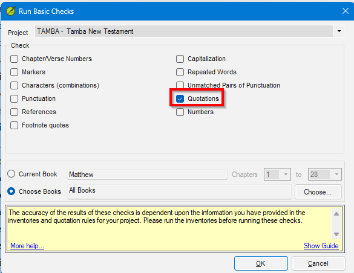
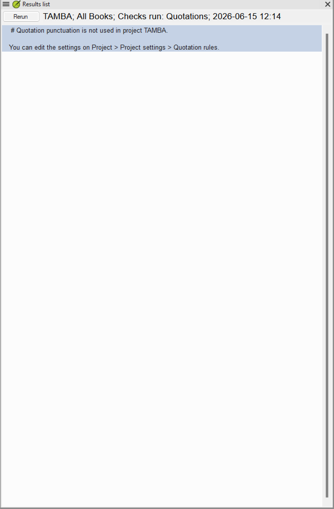

# Lesson 1 — What the Quotation Check Does

**Estimated time:** 30 minutes

> This lesson uses the fictional **Tamba New Testament** (`tamba`) project. See the
> [course README](README.md#the-fictional-project) for the Tamba quotation conventions and
> [Prerequisites](README.md#prerequisites) for setup.

**Learning objectives:** By the end of this lesson you will be able to (1) explain why the Quotation check cannot produce useful results before it is configured, and (2) describe the two things Paratext needs — inventory and rules — before the check is meaningful.

## Concept

Paratext's **Quotation check** (☰ > Tools > Run basic checks... > Quotations) scans your translation for unmatched, unopened, or incorrectly nested quotation marks. Before it can do this it needs two things:

1. **Quote marks tab** — which characters in your text are quotation marks, and at what level (Opening, Quote Continuer at new paragraph, Closing for each level).
2. **Quotation types tab** — for each semantic category of speech, whether marks are required, forbidden, or optional.

If neither is configured, the check either fires on every verse or fires on nothing — both are useless. The exercises in this course move you from that unconfigured state to a clean, meaningful check result.

### Exercise 1.1 — Observe an unconfigured check

**Goal:** See what the check reports when nothing is configured, so you understand why configuration matters.

**Steps:**
1. Open the `tamba` project.
2. Click **☰ > Tools > Run basic checks...**
3. In the dialog, tick **Quotations** only (leave "Quotation types" unticked — it is a separate check).
4. Click **Choose Books** and select all NT books available in the `tamba` project, then click **OK**. This runs the check across the whole project so you can see the full scope of the problem.

> **Note:** A yellow information bar at the bottom of the dialog reads *“The accuracy of the results of these checks is dependent upon the information you have provided in the inventories and quotation rules for your project.”* This is expected — the point of Exercise 1.1 is that the check cannot give accurate results until it is configured.

5. Scroll through the results list.

> **Scope tip:** For all configuration work in Lessons 2–4, use **Current Book** in the Run basic checks dialog and keep Matthew open — it has heavy, representative dialogue and keeps results manageable. Switch to Choose Books and expand to the full NT only after Matthew is clean.

**Discovery prompts:**
- How many results are listed? Are they spread across many books, or concentrated in one?
- Pick three results at random. Open the verse. Do you see what you would call a "real" quotation problem, or does it look like the text is fine?
- What do you think is causing all these results?

**What you should observe:** The check either reports hundreds of false positives (if it defaults to expecting straight double-quote characters that Tamba does not use) or reports nothing at all. Either way the results are not trustworthy until you configure the Quote marks tab.

## Lesson 1 summary
- The Quotation check needs both the Quote marks tab (which characters are quote marks) and the Quotation types tab (when marks are expected) configured before it gives trustworthy results.
- An unconfigured check is not a starting baseline — it is noise. Don't try to interpret or fix results until configuration is complete.

## Check your understanding

1. The Quotations check runs on an unconfigured project and returns zero results. Does this mean the translation has no quotation errors? Explain your answer.
2. What are the two things Paratext needs before the Quotations check gives meaningful results?
3. Why start with Matthew when working through check results during configuration, rather than running the check on the whole NT at once?

**Answers**

1. No. Zero results on an unconfigured project means Paratext does not know which characters to look for — it is not finding marks rather than confirming their absence. The check is reporting silence, not correctness.
2. (1) The Quote marks tab — which characters in the text are quote marks and at what level. (2) The Quotation types tab — whether each semantic category of speech requires, forbids, or optionally allows marks.
3. Matthew has heavy, representative dialogue with clear nesting. One book keeps results manageable and lets you confirm each fix before expanding scope.

---

Next: [Lesson 2 — Setting Up Quote Marks](02-setting-up-quote-marks.md)
