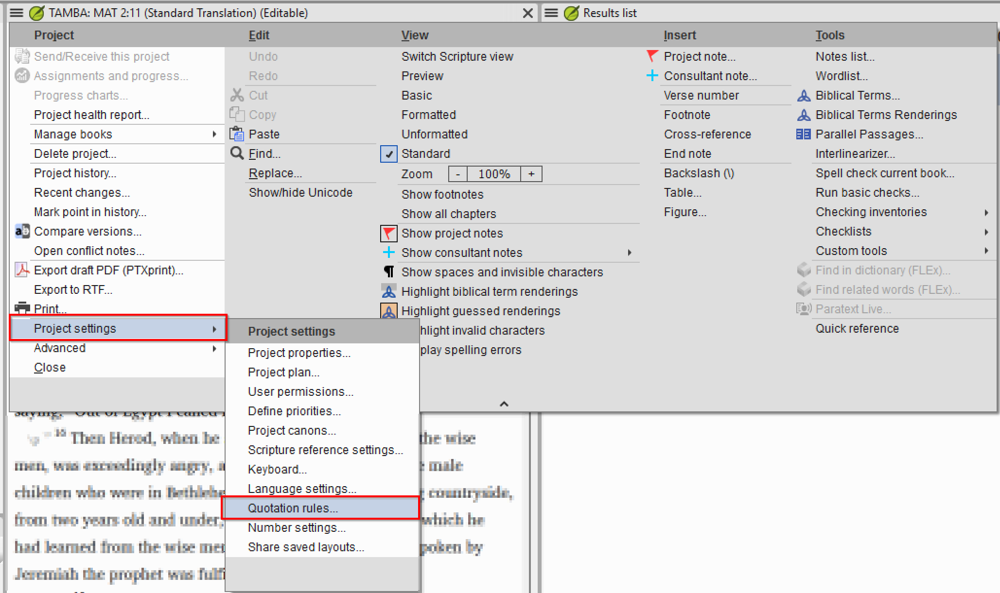
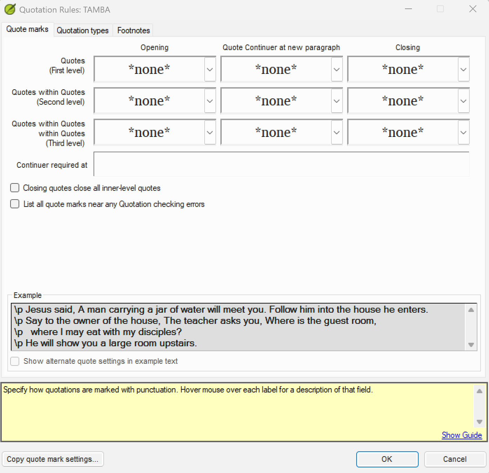
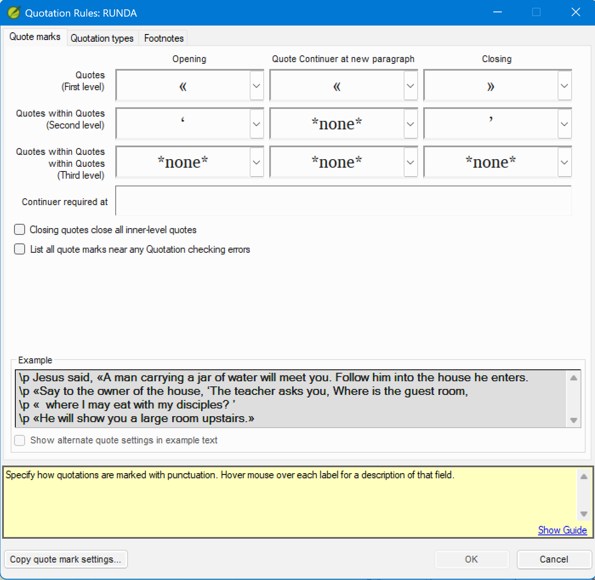
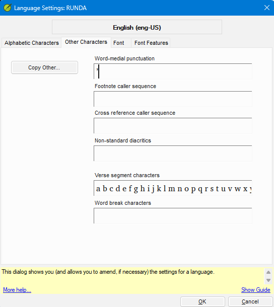

# Lesson 2 — Setting Up Quote Marks

**Estimated time:** 75 minutes

> This lesson uses the `tamba` and `runda` fictional projects. See the
> [course README](README.md#the-fictional-project) for their quotation conventions.

**Learning objectives:** By the end of this lesson you will be able to (1) navigate to the Quote marks tab and enter the correct characters for each nesting level, (2) configure the Quote Continuer at new paragraph for languages that use continuation marks, and (3) resolve the word-medial punctuation conflict when the same character serves as both a closing mark and apostrophe.

## Concept

The **Quote marks** tab tells Paratext which characters your language uses to open and close quotations at each nesting level, and which character (if any) continues a speech across a paragraph break. Navigate to:

project menu **☰ > Project settings > Quotation Rules**, then click the **Quote marks** tab.

The tab has a grid with three rows and three columns.

**Rows — nesting levels:**
- **Quotes (First level)** — primary speech
- **Quotes within Quotes (Second level)** — speech embedded within a First level quotation
- **Quotes within Quotes within Quotes (Third level)** — speech embedded within a Second level quotation

**Columns:**
- **Opening** — the character that starts a quotation at that level
- **Quote Continuer at new paragraph** — the character repeated at the beginning of a new paragraph when a quotation continues (many languages leave this blank)
- **Closing** — the character that ends a quotation at that level

Below the grid the tab has several additional checkboxes (such as **Closing quotes close**, **List all quote marks...**, and **Continuer required at...**). Hover over any label to see its description in the status bar at the bottom of the dialog.

At the bottom of the dialog:
- **Example** — a live text preview showing how your configured marks look in a sample passage. Use this to visually confirm that you have selected the correct characters.
- **Copy quote mark settings...** button — imports character settings from another project (useful when a related project uses the same conventions).

---

### Exercise 2.1 — Entering Quote Marks for Tamba

Open the Tamba project’s Quotation Rules dialog (☰ > Project settings > Quotation Rules) and click the **Quote marks** tab.

The Tamba project is in Phase A: the Quote marks tab is blank. Enter the following settings using the dropdown arrow (▼) on each cell:

| Level | Opening | Quote Continuer at new paragraph | Closing |
| --- | --- | --- | --- |
| First level | `“` (U+201C) | *(leave blank)* | `”` (U+201D) |
| Second level | `‘` (U+2018) | *(leave blank)* | `’` (U+2019) |
| Third level | `“` (U+201C) | *(leave blank)* | `”` (U+201D) |

**Steps:**
1. Click the dropdown (▼) on the **Opening** cell for First level. Select `“` (Left double quotation mark, U+201C).
2. Leave the **Quote Continuer at new paragraph** cell for First level blank.
3. Click the dropdown on the **Closing** cell for First level. Select `”` (Right double quotation mark, U+201D).
4. Repeat for Second level: Opening = `‘` (U+2018), Continuer = blank, Closing = `’` (U+2019).
5. Repeat for Third level: Opening = `“` (U+201C), Continuer = blank, Closing = `”` (U+201D).
6. Check the **Example** section at the bottom of the dialog. The sample text should show `“…‘…’…”` — curly double quotes at the outer level and curly single quotes for embedded speech.
7. Click **OK**.

Tamba uses English-style curly quotes at all three levels with no Quote Continuer — Tamba closes and reopens quotation marks at each paragraph break rather than using a continuation character.

> **Tip:** Hover over any column or row label (“Opening”, “Closing”, “Quotes (First level)”, etc.) to see a description of that field in the status bar at the bottom of the dialog.

---

### Exercise 2.2 — Entering Quote Marks for Runda

Open the Runda project and navigate to ☰ > Project settings > Quotation Rules > Quote marks tab.

Runda is a new project with no quote marks configured. Enter the following settings:

| Level | Opening | Quote Continuer at new paragraph | Closing |
| --- | --- | --- | --- |
| First level | `«` (U+00AB) | `«` (U+00AB) | `»` (U+00BB) |
| Second level | `‘` (U+2018) | *(leave blank)* | `’` (U+2019) |
| Third level | *(leave blank)* | *(leave blank)* | *(leave blank)* |

Runda uses French-style guillemets at the first level with no continuation mark at the second level.

**Steps:**
1. Click the dropdown arrow (▼) on the **Opening** cell for First level. Select « from the list.
2. Click the dropdown arrow on the **Quote Continuer at new paragraph** cell for First level. Select «.
3. Click the dropdown arrow on the **Closing** cell for First level. Select ».
4. Click the dropdown arrow on the **Opening** cell for Second level. Select ‘ (U+2018).
5. Click the dropdown arrow on the **Closing** cell for Second level. Select ’ (U+2019).
6. Leave all Third level cells at **\*none\***.
7. Check the **Example** section at the bottom of the dialog. You should see «...» for First level speech and ‘...’ for embedded speech.
8. Click **OK**.

---

### Exercise 2.3 — Handling Word-Medial Punctuation (the Apostrophe Conflict)

Some languages use the same character for two distinct purposes: as the **closing quotation mark** at the single-quote level, and as an **apostrophe** within words. When Paratext sees that character inside a word it cannot know whether it is ending a quotation or marking a contraction or possessive.

In Paratext 9.5 this conflict is resolved **not** in the Quotation Rules dialog, but in Language Settings:

**☰ > Project settings > Language Settings**

In the Language Settings dialog, click the **Other Characters** tab. This tab has a **Word-medial punctuation** field. Any character listed there is treated as part of a word when it appears between two alphabetic characters, so the quotation checker will not misread it as a closing mark.

**When to use this:**
- Your Second or Third level closing mark is `’` (U+2019), AND
- The same character also appears as an apostrophe inside words (contractions, possessives, glottal stops written with that character)

If both conditions apply, add `’` to the Word-medial punctuation field in Language Settings. The quotation checker will then treat `’` as part of a word when it is flanked by letters, and will only read it as a closing mark when it appears at the end of a quotation.

**Tamba scenario:** Tamba’s Second level closing mark is `’` (U+2019). Tamba does not use contractions with apostrophes, so no word-medial punctuation setting is needed. But if Tamba began using `’` as an apostrophe, you would add it to the Word-medial punctuation field.

**Exercise steps (Runda):**
Runda also uses `’` (U+2019) as its Second level closing mark. Suppose Runda does use `’` as an apostrophe.

1. Navigate to ☰ > Project settings > Language Settings > Other Characters tab.
2. In the **Word-medial punctuation** field, enter `’` (U+2019).
3. Click **OK**.
4. Re-run the quotation check on a chapter that has both apostrophes and single-quote speech. Verify that apostrophes inside words no longer generate false quotation errors.

## Lesson 2 summary
- The Quote marks tab grid has three rows (First, Second, Third level) and three columns (Opening, Quote Continuer at new paragraph, Closing).
- Verify every character you enter by checking the Example section at the bottom of the dialog.
- The Quote Continuer at new paragraph is optional; leave it blank if your language does not use one.
- When a closing-quote character doubles as an apostrophe, resolve the conflict in ☰ > Project settings > Language Settings > Other Characters tab > Word-medial punctuation.

## Check your understanding

1. A language uses `««` (U+00AB U+00AB) and `»»` (U+00BB U+00BB) for First level speech and `«` / `»` for Second level speech. Where do you enter these characters in PT 9.5?
2. What is the Quote Continuer at new paragraph column for? Give an example of when you would leave it blank.
3. Your Second level closing mark is `’` (U+2019). The quotation check is flagging apostrophes inside words as unclosed quotations. Where in PT 9.5 do you resolve this, and what do you enter?

**Answers**

1. In the **Quote marks tab** of the Quotation Rules dialog (☰ > Project settings > Quotation Rules). Enter `««` in the Opening cell for First level, `»»` in the Closing cell for First level, `«` in the Opening cell for Second level, and `»` in the Closing cell for Second level.
2. The Quote Continuer at new paragraph character is repeated at the beginning of each new paragraph when a single speech spans multiple paragraphs. Leave it blank if your language closes and reopens the quotation marks at each paragraph break rather than using a continuation mark (most Western European languages do this).
3. Navigate to ☰ > Project settings > Language Settings > Other Characters tab. Enter `’` (U+2019) in the **Word-medial punctuation** field. This tells the checker to treat that character as part of a word when it appears between two alphabetic characters.

---

Previous: [Lesson 1 — What the Quotation Check Does](01-what-the-quotation-check-does.md) · Next: [Lesson 3 — Configuring Quotation Types](03-configuring-quotation-types.md)
