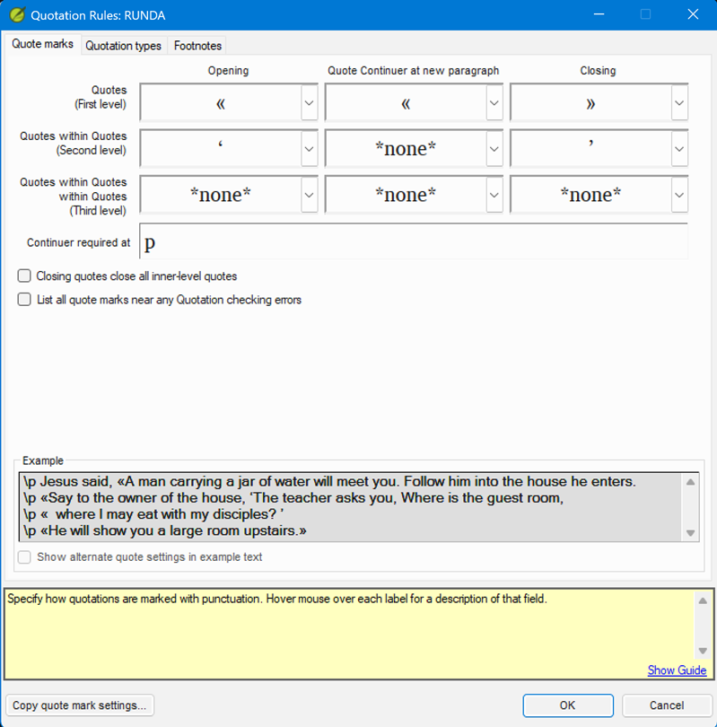
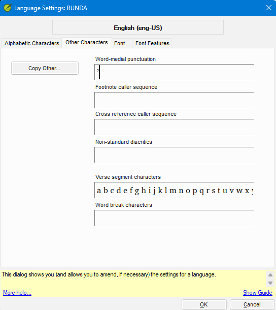

# Lesson 2 — Setting Up Quote Marks

**Estimated time:** 90 minutes

> This lesson uses the `tamba` and `runda` fictional projects. See the
> [course README](README.md#the-fictional-project) for their quotation conventions.

**Purpose:** Every language marks speech differently — curly quotes, guillemets, a character
that doubles as an apostrophe. On a real project your job is to translate those conventions
into Paratext's Quote marks grid correctly, so the Quotation check finally has something
meaningful to look for. This lesson gives the check the first of its two inputs.

## Learning objectives

By the end of this lesson you will be able to:

- Navigate to the Quote marks tab and enter the correct characters for each nesting level.
- Configure the Quote Continuer at new paragraph for languages that use continuation marks,
  and fill the **Continuer required at** list that tells the check *where* to expect it.
- Recognize the word-medial punctuation conflict when the same character serves as both a
  closing mark and an apostrophe, and explain why it cannot be fully resolved through Paratext
  settings when that character is also configured as a quote mark.

## Connect

In [Lesson 1](01-what-the-quotation-check-does.md) you saw that an unconfigured check is just
noise. Now you give it the first thing it needs: the actual characters your language uses.

**✏️ Reflection.** Picture the language project you work with (or one you expect to support):

- What characters does it use to open and close direct speech? Are they curly quotes (`“ ”`),
  guillemets (`« »`), straight quotes, or something else?
- When speech is quoted *inside* other speech, does the language use a different mark for that
  inner level?
- Have you ever seen a checker flag an apostrophe *inside* a word — a contraction or a glottal
  stop — as a broken quotation? What did you do about it?

Hold those in mind. Two of the three exercises in this lesson are exactly these situations.

## Content

*Configuring the Quote marks tab is the first half of the **Translation Tools** competency's
"use and troubleshoot" skill for this check. Get the inventory of characters right here and
most of the false positives from Lesson 1 disappear.*

The **Quote marks** tab tells Paratext which characters your language uses to open and close
quotations at each nesting level, and which character (if any) continues a speech across a
paragraph break. Navigate to:

project menu **☰ > Project settings > Quotation Rules**, then click the **Quote marks** tab.


The tab has a grid with three rows and three columns.

**Rows — nesting levels:**
- **Quotes (First level)** — primary speech
- **Quotes within Quotes (Second level)** — speech embedded within a First level quotation
- **Quotes within Quotes within Quotes (Third level)** — speech embedded within a Second level
  quotation

**Columns:**
- **Opening** — the character that starts a quotation at that level
- **Quote Continuer at new paragraph** — the character repeated at the beginning of a new
  paragraph when a quotation continues (many languages leave this blank)
- **Closing** — the character that ends a quotation at that level

Below the grid the tab has a few additional settings — checkboxes such as **Closing quotes
close** and **List all quote marks...**, and one text field, **Continuer required at**, which
matters far more than its size suggests. Hover over any label to see its description in the
status bar at the bottom of the dialog.

### Continuer required at — the half of the continuer people miss

The continuer cell in the grid tells Paratext *which character* continues a speech. It does
**not** tell Paratext *where* to expect that character. Without that second piece, the check
has no way to tell a continuer `“` at the head of a paragraph from a brand-new opening `“`, so
it reads every one as a fresh quotation that is never closed. A long speech that runs across
many paragraphs — the Sermon on the Mount, for instance — then produces an unclosed-quote
result at every paragraph, even though the continuer cell is filled in correctly. (Confirmed
against Paratext 9.5.)

The **Continuer required at** field supplies the *where*. It is a space-separated list of
paragraph-marker contexts. Each entry takes one of two shapes:

- **A bare marker**, such as `p` — a continuer is required at the start of every `\p`
  paragraph that falls inside an open quotation.
- **A previous-marker / marker pair**, such as `p/q1` — a continuer is required at a `\q1`
  line only when it directly follows a `\p` paragraph. This is how you cover a speech that moves
  from prose into quoted poetry (`p/q1`, `b/q1`, `m/q1`), or through indented paragraphs
  (`s1/pi`, `pi/pi`), without demanding a continuer on every poetry line.

**Where does the list come from?** From the text, not from a catalogue. You do not need to know
every USFM paragraph marker — only the ones *this project* uses at points where a speech can
run on. Two ways to find them:

1. Open a long speech (the Sermon on the Mount in Matthew 5–7 is ideal) and note every
   paragraph marker that appears between its opening and closing marks. Each is a candidate
   entry; each change of marker inside the speech is a candidate pair. Then check the text at
   each candidate: does the continuer character actually appear there? A marker the text does
   *not* carry a continuer at must stay off the list, even if it sits inside the speech.
2. Use Paratext's **Markers inventory** (☰ > Tools > Checking Inventories) to list every
   marker the project uses at all, with a count for each. Select a paragraph marker in the
   upper pane and the lower pane lists every verse where it occurs, so you can double-click into
   a few and see whether they fall inside speech. Keep the paragraph markers that do. Section
   headings (`\s1`) never carry a continuer themselves, but a paragraph that *follows* a heading
   inside a running speech may, which is what a pair like `s1/pi` expresses.


Most New Testament projects end up with a list of four to six entries. A project with heavy
poetry, lists, or indented material has a longer list, but it is built the same way. Both
exercises below give you the finished list for the project so you can concentrate on the
mechanics; the **Take it to your context** task at the end asks you to derive one yourself.

At the bottom of the dialog:
- **Example** — a live text preview showing how your configured marks look in a sample
  passage. Use this to visually confirm that you have selected the correct characters.
- **Copy quote mark settings...** button — imports character settings from another project
  (useful when a related project uses the same conventions).


**One more setting lives elsewhere, but it has a real limit.** Some languages use the same
character for two purposes: as the **closing quotation mark** at the single-quote level *and*
as an **apostrophe** within words. Paratext's Language Settings has a field for exactly this
kind of ambiguous character — **☰ > Project settings > Language Settings > Other Characters**
tab, **Word-medial punctuation** — and its own help text describes it as telling the checker to
treat a listed character as part of a word rather than punctuation when it sits between two
letters.

**Verified on Paratext 9.5, this does *not* work for a character that is also a configured
quote mark.** Adding `’` to Word-medial punctuation has no effect on the "Closing quote found as
a word medial character" result when `’` is also set as a Second (or Third) level closing mark
— the check keeps flagging every genuine apostrophe, with or without the setting. Once a
character is claimed as a quote mark in the Quotation Rules dialog, that classification appears
to take priority over the Word-medial punctuation exception list. The setting genuinely works
for punctuation that *isn't* also a quote character; it just doesn't rescue this specific
collision.

**What this means in practice:** if a language's real orthography reuses a quote-mark character
as an apostrophe, there is no configuration that makes the check stop flagging it. The
practical options are (a) recognize each such result during triage as a known, expected
false positive — a real apostrophe, not a translation error — and move past it rather than
hunting for a setting to clear it, or (b) if the orthography is still being finalized, choose a
different, unique character for the apostrophe so the two roles don't collide in the first
place. You'll see this firsthand in the third exercise below.

**Key takeaways**

- The Quote marks tab grid has three rows (First, Second, Third level) and three columns
  (Opening, Quote Continuer at new paragraph, Closing).
- Always verify every character you enter using the **Example** section at the bottom of the
  dialog — confirm the code point, not just the shape.
- The Quote Continuer at new paragraph is optional; leave it blank if your language closes and
  reopens the marks at each paragraph break.
- If you fill the continuer cell, you **must** also fill **Continuer required at** with the
  paragraph markers (and marker transitions like `p/q1`) where the continuer is expected. The
  character alone does nothing; with the list empty, every continuer is reported as an unclosed
  opening mark.
- When a closing-quote character doubles as an apostrophe, Word-medial punctuation in Language
  Settings does **not** suppress the resulting check result (confirmed against real Paratext
  9.5 behavior) — treat every such flag as an expected false positive to verify and set aside
  during triage, not a configuration problem to fix.

## Challenge

You will configure two real (fictional) projects and then untangle the apostrophe conflict.
Each exercise produces a configured tab a mentor can inspect against the language's convention
table in the README.

### Exercise 2.1 — Enter quote marks for Tamba

Open the Tamba project's Quotation Rules dialog (☰ > Project settings > Quotation Rules) and
click the **Quote marks** tab.

The Tamba project is in Phase A: the Quote marks tab is blank. Enter the following settings
using the dropdown arrow (▼) on each cell:

| Level | Opening | Quote Continuer at new paragraph | Closing |
| --- | --- | --- | --- |
| First level | `“` (U+201C) | `“` (U+201C) | `”` (U+201D) |
| Second level | `‘` (U+2018) | *(leave blank)* | `’` (U+2019) |
| Third level | `“` (U+201C) | *(leave blank)* | `”` (U+201D) |

**Steps:**
1. Click the dropdown (▼) on the **Opening** cell for First level. Select `“` (Left double
   quotation mark, U+201C).
2. Click the dropdown on the **Quote Continuer at new paragraph** cell for First level. Select
   `“` (U+201C) — the same character as the Opening mark.
3. Click the dropdown on the **Closing** cell for First level. Select `”` (Right double
   quotation mark, U+201D).
4. Repeat for Second level: Opening = `‘` (U+2018), Continuer = blank, Closing = `’` (U+2019).
5. Repeat for Third level: Opening = `“` (U+201C), Continuer = blank, Closing = `”` (U+201D).
6. Check the **Example** section at the bottom of the dialog. The sample text should show
   `“…‘…’…”` — curly double quotes at the outer level and curly single quotes for embedded
   speech.
7. In the **Continuer required at** field below the grid, enter exactly:

   ```
   p p/q1 m/q1 s1/pi pi/pi b/q1
   ```

   Type it with single spaces between entries. Do not skip this step — see the table after
   the steps for what each entry is doing.
8. Click **OK**.


Tamba uses English-style curly quotes at all three levels. First level speech that spans a
paragraph break repeats the opening mark `“` (U+201C) as a Quote Continuer at the head of each
new paragraph; the closing mark `”` (U+201D) appears only once, at the very end of the whole
speech. Second and Third level have no continuer — a quotation at either of those levels that
spans a paragraph break closes fully and reopens fully at each new paragraph instead.

**Why that list?** Tamba's text uses ordinary `\p` paragraphs for most speech, quoted poetry
introduced from prose or after a blank line, and indented `\pi` paragraphs after section
headings. Each entry covers one of those situations:

| Entry | Continuer required… | Where Tamba does this |
| --- | --- | --- |
| `p` | at the start of every `\p` paragraph inside an open speech | Every verse of the Sermon on the Mount (Matthew 5:4–7:27) |
| `p/q1` | at a `\q1` poetry line that follows a `\p` paragraph | A speech that quotes Scripture as poetry mid-paragraph |
| `m/q1` | at a `\q1` line that follows a `\m` (no-indent) paragraph | Same, after a continuation paragraph |
| `b/q1` | at a `\q1` line that follows a `\b` blank line | A second stanza of quoted poetry |
| `s1/pi` | at an indented `\pi` paragraph that follows a `\s1` heading | A speech that continues past a section heading |
| `pi/pi` | at a `\pi` paragraph that follows another `\pi` | Consecutive indented paragraphs within one speech |

If you were configuring Tamba from scratch you would build this list by reading Matthew 5–7
and Acts 2 and noting which markers appear inside the speeches. You will do exactly that for a
real project in the **Take it to your context** task.

**Check it worked.** Run the Quotation check (☰ > Tools > Run basic checks, Quotations only)
on all of Tamba's books. With the grid *and* the list filled, the result should be **"No errors
found"** — Phase A's text is clean, and the Sermon on the Mount (Matthew 5:3–7:27) now reads as
one correctly continued speech. Two other outcomes tell you what went wrong:

- *"Quotation punctuation is not used in project TAMBA"* — the grid is still empty. The dialog
  was closed with Cancel or the window's X instead of **OK**. Reopen it, re-enter, click OK.
- A run of unclosed-quote results at every verse from Matthew 5:4 onward — the grid saved but
  the **Continuer required at** field is empty or has a typo. That field is by far the most
  common cause of this pattern.

(This is only the Quotations check. The separate Quotation types check, which Lesson 3
configures, is not enabled yet and adds its own results once it is.)

**TIP** Hover over any column or row label ("Opening", "Closing", "Quotes (First level)",
etc.) to see a description of that field in the status bar at the bottom of the dialog.

### Exercise 2.2 — Enter quote marks for Runda

Open the Runda project and navigate to ☰ > Project settings > Quotation Rules > Quote marks
tab.

Runda is a new project with no quote marks configured. Enter the following settings:

| Level | Opening | Quote Continuer at new paragraph | Closing |
| --- | --- | --- | --- |
| First level | `«` (U+00AB) | `«` (U+00AB) | `»` (U+00BB) |
| Second level | `‘` (U+2018) | *(leave blank)* | `’` (U+2019) |
| Third level | *(leave blank)* | *(leave blank)* | *(leave blank)* |

Runda uses French-style guillemets at the first level with no continuation mark at the second
level.

**Steps:**
1. Click the dropdown arrow (▼) on the **Opening** cell for First level. Select « from the
   list.
2. Click the dropdown arrow on the **Quote Continuer at new paragraph** cell for First level.
   Select «.
3. Click the dropdown arrow on the **Closing** cell for First level. Select ».
4. Click the dropdown arrow on the **Opening** cell for Second level. Select ‘ (U+2018).
5. Click the dropdown arrow on the **Closing** cell for Second level. Select ’ (U+2019).
6. Leave all Third level cells at **\*none\***.
7. Check the **Example** section at the bottom of the dialog. You should see «...» for First
   level speech and ‘...’ for embedded speech.
8. In the **Continuer required at** field, enter just:

   ```
   p
   ```

   Runda's text does use `\q1`/`\q2` poetry inside speech — Matthew 2:6 and 4:6 quote Scripture
   that way — but look at how it is written: the poetry line opens straight into the Second
   level `‘` with no `«` in front of it. Runda repeats its continuer only at `\p` paragraphs, so
   `p` is the whole list. Adding `p/q1` here would make the check demand a `«` the text never
   carries, and you would get "Expected continuers [«] are missing" at every quoted poem.
9. Click **OK**.

**Check it worked.** Run the Quotation check on Matthew. You should see **no** "Expected
continuers" or "Quote opened; see following message" results at Matthew 2:5–6 or 4:6. What you
*will* see is a long list of "Closing quote [’] found as a word medial character" results — one
for almost every apostrophe in the book — plus a pair of results at **5:3 and 5:10** that look
alarming: "Opening quote mark found without matching closing quote mark: «" at 5:3 and "Closing
quote [’] found without matching opening" at 5:10. Leave all of these alone for now. Exercise 2.3
is about exactly these results, including why 5:3 is reported when nothing at 5:3 is wrong.



**✏️ Compare.** Runda and Tamba both fill the Quote Continuer cell at First level — Runda with
`«`, Tamba with `“` — because both languages repeat the opening mark at the start of each
continued paragraph rather than closing and reopening. Now compare Second level: both leave it
blank there, since embedded quotations in both languages close and reopen fully rather than
continuing across a paragraph break. The convention table drives the configuration — never the
other way around, so don't assume one language's pattern applies to another, or that every
nesting level within the same language behaves the same way.

Now compare the two **Continuer required at** lists. Both languages use a continuer, but Tamba's
list has six entries and Runda's has one, because the list describes what the *text does*, not
what the language's punctuation convention says. Both projects quote poetry inside speech;
Tamba's text repeats the continuer at the head of the poetry, Runda's does not. Get the list
wrong in either direction and the check tells you, with a different message each way:

| List is… | What you see | Example |
| --- | --- | --- |
| Too short (a marker the text *does* continue at is missing) | "Quote opened…" followed by an unclosed-quote result at every paragraph of a long speech | Tamba with an empty field: the whole Sermon on the Mount |
| Too long (a marker the text does *not* continue at is listed) | "Expected continuers [«] are missing" at each place the listed marker occurs inside speech | Runda with `p/q1` added: Matthew 2:6, 4:6 |

Either way the fix is in the field, not the text. The text is the authority; the list is
your description of it.

### Exercise 2.3 — The word-medial punctuation conflict (and its limit)

Recall from the Content section: some languages use the same character as a **closing mark**
at the single-quote level *and* as an **apostrophe** within words. Paratext has a field that
looks designed for exactly this — but verified against real Paratext 9.5 behavior, it does not
actually resolve the conflict when that character is also a quote mark. This exercise walks you
through the setting so you can see that limitation firsthand, rather than assuming it works
because the field exists.

**☰ > Project settings > Language Settings**, then click the **Other Characters** tab. This tab
has a **Word-medial punctuation** field. Its own help text says any character listed there is
treated as part of a word when it appears between two alphabetic characters, so the checker
should not misread it as a closing mark.



**Where this genuinely helps:** punctuation characters that are *not* also configured as a
quote mark — a hyphen used word-medially, for instance. Paratext will warn you if you enter a
character here that's also registered as a quote mark in Quotation Rules ("unique characters
are recommended"); that warning is a real signal, not just caution — it means the setting won't
do what you're about to try to use it for.

**Do it (Runda):** Runda uses `’` (U+2019) as its Second level closing mark — and its text also
uses `’` as an apostrophe in *don’t*, *can’t*, *righteousness’ sake*. A genuine collision, and
you already saw its footprint in the results at the end of Exercise 2.2.

1. Navigate to ☰ > Project settings > Language Settings > Other Characters tab.
2. In the **Word-medial punctuation** field, enter `’` (U+2019). Paratext will warn that this
   character is already a quote mark. Confirm through the warning and click **OK** anyway.
3. Re-run the quotation check (a full re-run, not just "Rerun" on an already-open results
   panel) on a chapter that has both apostrophes and single-quote speech.
4. **Observe that the apostrophes are still flagged.** The check keeps reporting "Closing quote
   found as a word medial character" for every genuine apostrophe, exactly as before you added
   the setting. This is the expected, confirmed outcome — not a sign you configured something
   wrong.
5. **Now look at Matthew 5:3 and 5:10.** The same collision has a second, nastier face. In
   *don’t* the `’` sits between two letters, so the check at least recognizes it as
   word-medial and says so. In `righteousness’ sake` (5:10) the `’` is at the **end** of the word
   — a plural possessive — so the check simply sees a Second level closing mark with no opening
   and reports "Closing quote [’] found without matching opening". Worse, that stray close
   knocks the check off the First level speech it was tracking, so it also reports "Opening
   quote mark found without matching closing quote mark: «" back at **5:3**, where the Sermon
   on the Mount begins. Nothing is wrong at 5:3: the speech closes correctly with `»` at 7:27.
   One apostrophe, two results, and the scarier one points at the wrong verse. Word-medial
   punctuation cannot help here either; it never applied to word-final characters in the first
   place. Runda's Matthew has a handful more of these (*kings’* 11:8, *Moses’* 23:2, *widows’*
   23:13, *Jesus’* 27:57–58), so expect the pattern to repeat.

**What to do instead, in real triage:** treat each of these results as a known false positive.
Open the verse, confirm the flagged character really is an apostrophe (word-medial or a
word-final possessive, not an actual unclosed quotation), and move on — there is no setting that
will make the result disappear. When a word-final apostrophe drags in a second result at the
start of the enclosing speech, check that the speech really does close where it should, then
set both results aside together.
Document this for whoever inherits the project, so a future checker doesn't waste time hunting
for a fix that doesn't exist.

**If the orthography is still being decided:** this is the one situation where the team has a
real fix available — Paratext's own warning when you enter `’` into Word-medial punctuation
("unique characters are recommended") is pointing at it. Recommend the language team adopt a
different, unique character for the apostrophe (or, less commonly, for the closing mark) so the
two roles never collide. That's a project-level decision for the translation team to make, not
something you configure your way around — but it's worth raising if the orthography isn't
locked in yet, since it's the only path that actually eliminates the false positives rather than
just documenting them.

A good concrete recommendation: **`ʼ` (U+02BC MODIFIER LETTER APOSTROPHE)**. It's the character
the Unicode Standard itself recommends for an apostrophe functioning as a letter — marking a
glottal stop or similar — as distinct from `’` (U+2019), which is meant for punctuation
(closing a quotation, or a generic typographic apostrophe in running prose). Visually it's a
small raised mark close in shape to `’`, so the orthography doesn't change much for readers, but
it's a completely different code point, so Paratext never confuses it with a configured quote
mark. For example, a word written `Kalaʼu` (U+02BC) would never generate a quotation result no
matter what the Second level closing mark is configured to — compare that to `Kala’u` (U+2019),
which collides the moment `’` is also a quote mark, exactly like Runda and Tamba above.

**Tamba scenario:** Tamba's Second level closing mark is `’` (U+2019). Tamba's Phase A text has
no contractions or apostrophes, so this conflict never comes up there — but if Tamba's real
orthography later needed apostrophes written with `’`, this is the same unresolvable collision
you just saw in Runda, not something a setting change would fix.

**✏️ Produce this (a mentor will review it).** After all three exercises, jot 3–4 sentences: which
project(s) and level(s) needed a Quote Continuer and why, what the **Continuer required at**
list adds that the continuer cell alone does not, and what you observed when you tried the
Word-medial punctuation fix for the apostrophe conflict — including that it did not suppress
the check result. A mentor will check your configured Quote marks tabs, including the
Continuer required at field, against the README convention tables.

## Change

**Self-assessment — can you explain it to a colleague?**

1. A language uses `««` (U+00AB U+00AB) and `»»` (U+00BB U+00BB) for First level speech and `«`
   / `»` for Second level speech. Where do you enter these characters in PT 9.5?
2. What is the Quote Continuer at new paragraph column for? Give an example of when you would
   leave it blank. And if you *do* fill it, what else must you fill, and what happens if you
   don't?
3. Your Second level closing mark is `’` (U+2019). The quotation check is flagging apostrophes
   inside words as unclosed quotations. Can you make this result disappear through
   configuration, and if not, what should you actually do about it?

*You should be able to say:* (1) In the **Quote marks tab** of the Quotation Rules dialog (☰ >
Project settings > Quotation Rules) — `««` in the First level Opening cell, `»»` in the First
level Closing cell, `«` in the Second level Opening cell, and `»` in the Second level Closing
cell. (2) It is the character repeated at the start of each new paragraph when one speech spans
multiple paragraphs; leave it blank when the language closes and reopens the marks at each
paragraph break (as most Western European languages do). If you fill it, you must also fill
**Continuer required at** with the paragraph markers and marker transitions (e.g. `p p/q1`)
where the continuer is expected; otherwise the check reads every continuer as a new opening
mark that is never closed and floods a long speech with unclosed-quote results. (3) No — adding `’` to ☰ > Project
settings > Language Settings > Other Characters tab > Word-medial punctuation does not suppress
this result when `’` is also a configured quote mark (confirmed against real Paratext 9.5
behavior). Treat each flagged instance as an expected false positive: open the verse, confirm
it's a genuine apostrophe, and move past it during triage rather than searching for a setting
that will clear it.

**✏️ Take it to your context.** For one real language you support, write the three-row Quote
marks table (First/Second/Third level, Opening / Continuer / Closing) as you believe it should
be configured. If any level has a continuer, open the longest speech in the project's text,
list every paragraph marker that appears inside it, and draft the **Continuer required at**
list from that — bare markers for paragraphs, pairs for the transitions. Note any character
that doubles as an apostrophe — that's your word-medial punctuation candidate.

**Next step.** The Quote marks tab tells Paratext *which characters* are quote marks. In
[Lesson 3](03-configuring-quotation-types.md) you give it the second input — the **Quotation
types** tab, which tells the check *when* marks are expected for each kind of speech.

---

Previous: [Lesson 1 — What the Quotation Check Does](01-what-the-quotation-check-does.md) · Next: [Lesson 3 — Configuring Quotation Types](03-configuring-quotation-types.md)
