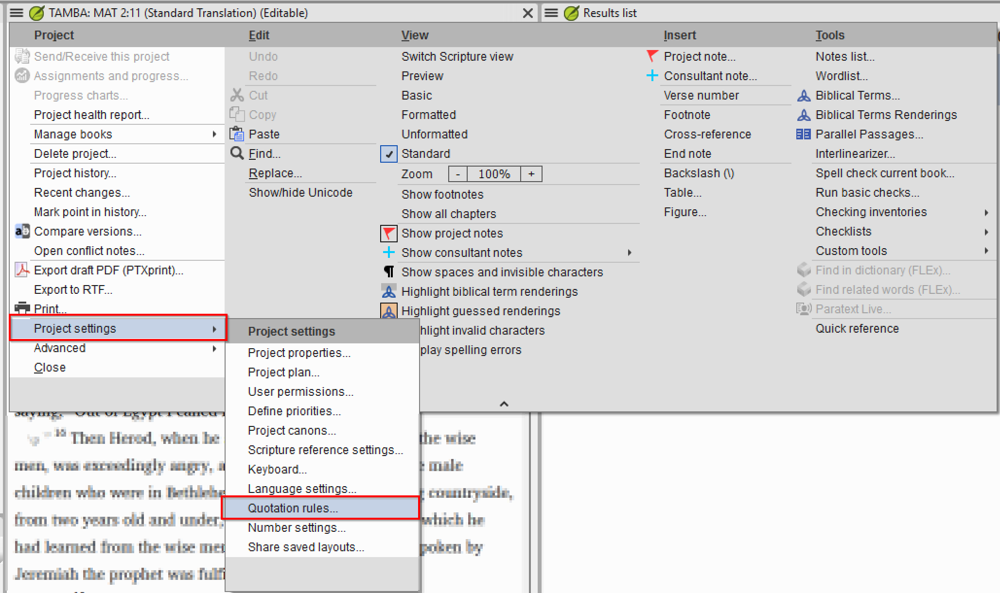
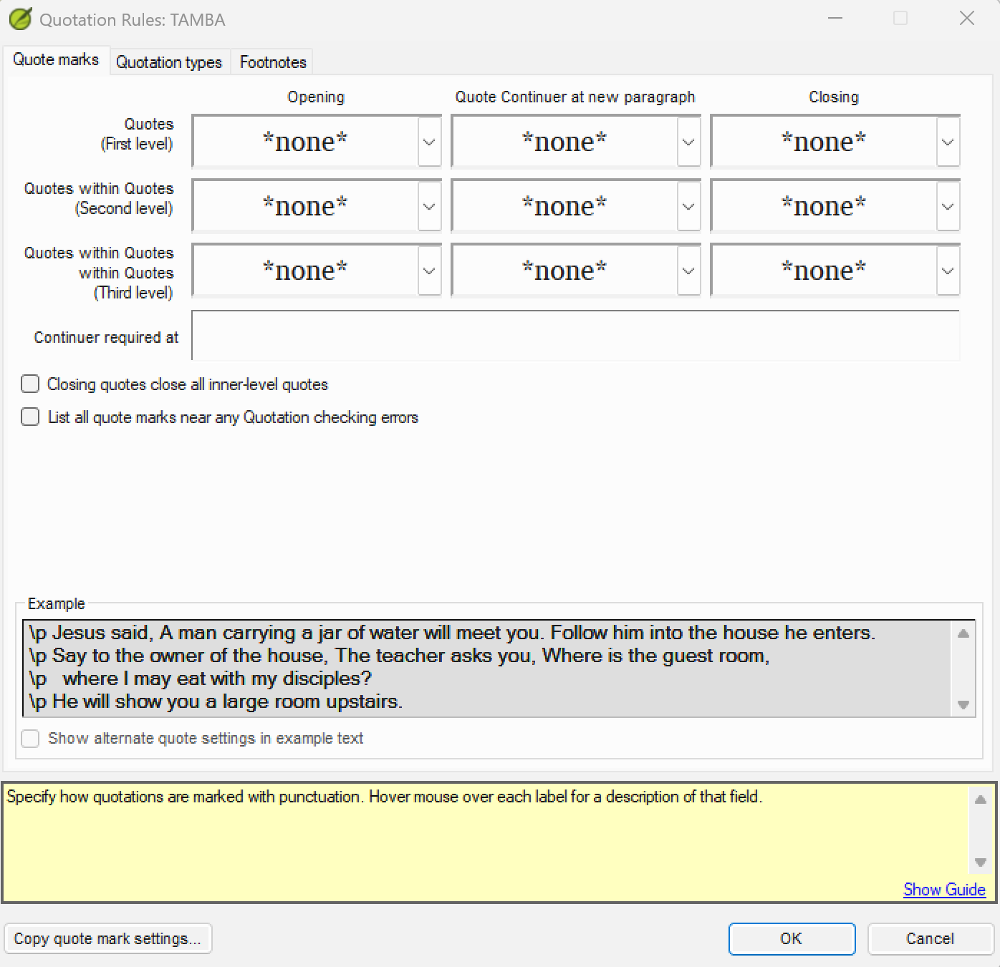
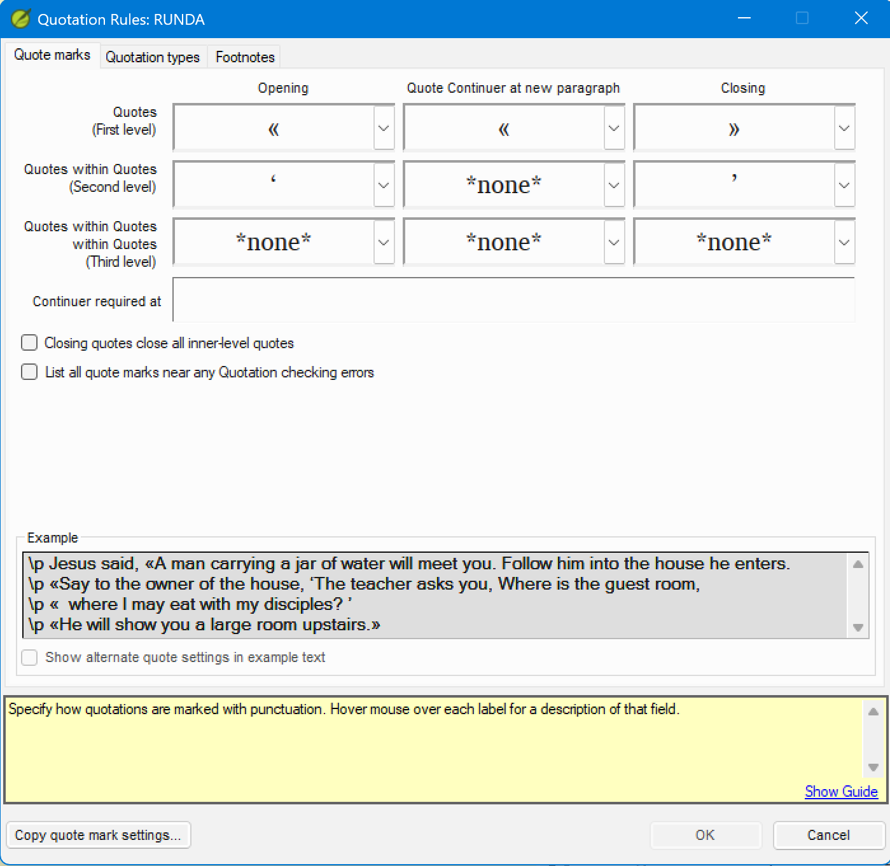

# Lesson 2 — Setting Up Quote Marks

**Estimated time:** 75 minutes

> This lesson uses the `tamba` and `runda` fictional projects. See the
> [course README](README.md#the-fictional-project) for their quotation conventions.

**Purpose:** Every language marks speech differently — curly quotes, guillemets, a character
that doubles as an apostrophe. On a real project your job is to translate those conventions
into Paratext's Quote marks grid correctly, so the Quotation check finally has something
meaningful to look for. This lesson gives the check the first of its two inputs.

## Learning objectives

By the end of this lesson you will be able to:

- Navigate to the Quote marks tab and enter the correct characters for each nesting level.
- Configure the Quote Continuer at new paragraph for languages that use continuation marks.
- Recognize the word-medial punctuation conflict when the same character serves as both a
  closing mark and an apostrophe, and explain why it cannot be fully resolved through Paratext
  settings when that character is also configured as a quote mark.

## Connect

In [Lesson 1](01-what-the-quotation-check-does.md) you saw that an unconfigured check is just
noise. Now you give it the first thing it needs: the actual characters your language uses.

**✏️ Reflection.** Picture the language project you work with (or one you expect to support):

- What characters does it use to open and close direct speech? Are they curly quotes (`“ ”`),
  guillemets (`« »`), straight quotes, or something else?
- When speech is quoted *inside* other speech, does the language use a different mark for that
  inner level?
- Have you ever seen a checker flag an apostrophe *inside* a word — a contraction or a glottal
  stop — as a broken quotation? What did you do about it?

Hold those in mind. Two of the three exercises in this lesson are exactly these situations.

## Content

*Configuring the Quote marks tab is the first half of the **Translation Tools** competency's
"use and troubleshoot" skill for this check. Get the inventory of characters right here and
most of the false positives from Lesson 1 disappear.*

The **Quote marks** tab tells Paratext which characters your language uses to open and close
quotations at each nesting level, and which character (if any) continues a speech across a
paragraph break. Navigate to:

project menu **☰ > Project settings > Quotation Rules**, then click the **Quote marks** tab.

The tab has a grid with three rows and three columns.

**Rows — nesting levels:**
- **Quotes (First level)** — primary speech
- **Quotes within Quotes (Second level)** — speech embedded within a First level quotation
- **Quotes within Quotes within Quotes (Third level)** — speech embedded within a Second level
  quotation

**Columns:**
- **Opening** — the character that starts a quotation at that level
- **Quote Continuer at new paragraph** — the character repeated at the beginning of a new
  paragraph when a quotation continues (many languages leave this blank)
- **Closing** — the character that ends a quotation at that level

Below the grid the tab has several additional checkboxes (such as **Closing quotes close**,
**List all quote marks...**, and **Continuer required at...**). Hover over any label to see its
description in the status bar at the bottom of the dialog.

At the bottom of the dialog:
- **Example** — a live text preview showing how your configured marks look in a sample
  passage. Use this to visually confirm that you have selected the correct characters.
- **Copy quote mark settings...** button — imports character settings from another project
  (useful when a related project uses the same conventions).

**One more setting lives elsewhere, but it has a real limit.** Some languages use the same
character for two purposes: as the **closing quotation mark** at the single-quote level *and*
as an **apostrophe** within words. Paratext's Language Settings has a field for exactly this
kind of ambiguous character — **☰ > Project settings > Language Settings > Other Characters**
tab, **Word-medial punctuation** — and its own help text describes it as telling the checker to
treat a listed character as part of a word rather than punctuation when it sits between two
letters.

**Verified on Paratext 9.5, this does *not* work for a character that is also a configured
quote mark.** Adding `’` to Word-medial punctuation has no effect on the "Closing quote found as
a word medial character" result when `’` is also set as a Second (or Third) level closing mark
— the check keeps flagging every genuine apostrophe, with or without the setting. Once a
character is claimed as a quote mark in the Quotation Rules dialog, that classification appears
to take priority over the Word-medial punctuation exception list. The setting genuinely works
for punctuation that *isn't* also a quote character; it just doesn't rescue this specific
collision.

**What this means in practice:** if a language's real orthography reuses a quote-mark character
as an apostrophe, there is no configuration that makes the check stop flagging it. The
practical options are (a) recognize each such result during triage as a known, expected
false positive — a real apostrophe, not a translation error — and move past it rather than
hunting for a setting to clear it, or (b) if the orthography is still being finalized, choose a
different, unique character for the apostrophe so the two roles don't collide in the first
place. You'll see this firsthand in the third exercise below.

**Key takeaways**

- The Quote marks tab grid has three rows (First, Second, Third level) and three columns
  (Opening, Quote Continuer at new paragraph, Closing).
- Always verify every character you enter using the **Example** section at the bottom of the
  dialog — confirm the code point, not just the shape.
- The Quote Continuer at new paragraph is optional; leave it blank if your language closes and
  reopens the marks at each paragraph break.
- When a closing-quote character doubles as an apostrophe, Word-medial punctuation in Language
  Settings does **not** suppress the resulting check result (confirmed against real Paratext
  9.5 behavior) — treat every such flag as an expected false positive to verify and set aside
  during triage, not a configuration problem to fix.

## Challenge

You will configure two real (fictional) projects and then untangle the apostrophe conflict.
Each exercise produces a configured tab a mentor can inspect against the language's convention
table in the README.

### Exercise 2.1 — Enter quote marks for Tamba

Open the Tamba project's Quotation Rules dialog (☰ > Project settings > Quotation Rules) and
click the **Quote marks** tab.

The Tamba project is in Phase A: the Quote marks tab is blank. Enter the following settings
using the dropdown arrow (▼) on each cell:

| Level | Opening | Quote Continuer at new paragraph | Closing |
| --- | --- | --- | --- |
| First level | `“` (U+201C) | `“` (U+201C) | `”` (U+201D) |
| Second level | `‘` (U+2018) | *(leave blank)* | `’` (U+2019) |
| Third level | `“` (U+201C) | *(leave blank)* | `”` (U+201D) |

**Steps:**
1. Click the dropdown (▼) on the **Opening** cell for First level. Select `“` (Left double
   quotation mark, U+201C).
2. Click the dropdown on the **Quote Continuer at new paragraph** cell for First level. Select
   `“` (U+201C) — the same character as the Opening mark.
3. Click the dropdown on the **Closing** cell for First level. Select `”` (Right double
   quotation mark, U+201D).
4. Repeat for Second level: Opening = `‘` (U+2018), Continuer = blank, Closing = `’` (U+2019).
5. Repeat for Third level: Opening = `“` (U+201C), Continuer = blank, Closing = `”` (U+201D).
6. Check the **Example** section at the bottom of the dialog. The sample text should show
   `“…‘…’…”` — curly double quotes at the outer level and curly single quotes for embedded
   speech.
7. Click **OK**.

Tamba uses English-style curly quotes at all three levels. First level speech that spans a
paragraph break repeats the opening mark `“` (U+201C) as a Quote Continuer at the head of each
new paragraph; the closing mark `”` (U+201D) appears only once, at the very end of the whole
speech. Second and Third level have no continuer — a quotation at either of those levels that
spans a paragraph break closes fully and reopens fully at each new paragraph instead.

**TIP** Hover over any column or row label ("Opening", "Closing", "Quotes (First level)",
etc.) to see a description of that field in the status bar at the bottom of the dialog.

### Exercise 2.2 — Enter quote marks for Runda

Open the Runda project and navigate to ☰ > Project settings > Quotation Rules > Quote marks
tab.

Runda is a new project with no quote marks configured. Enter the following settings:

| Level | Opening | Quote Continuer at new paragraph | Closing |
| --- | --- | --- | --- |
| First level | `«` (U+00AB) | `«` (U+00AB) | `»` (U+00BB) |
| Second level | `‘` (U+2018) | *(leave blank)* | `’` (U+2019) |
| Third level | *(leave blank)* | *(leave blank)* | *(leave blank)* |

Runda uses French-style guillemets at the first level with no continuation mark at the second
level.

**Steps:**
1. Click the dropdown arrow (▼) on the **Opening** cell for First level. Select « from the
   list.
2. Click the dropdown arrow on the **Quote Continuer at new paragraph** cell for First level.
   Select «.
3. Click the dropdown arrow on the **Closing** cell for First level. Select ».
4. Click the dropdown arrow on the **Opening** cell for Second level. Select ‘ (U+2018).
5. Click the dropdown arrow on the **Closing** cell for Second level. Select ’ (U+2019).
6. Leave all Third level cells at **\*none\***.
7. Check the **Example** section at the bottom of the dialog. You should see «...» for First
   level speech and ‘...’ for embedded speech.
8. Click **OK**.

**✏️ Compare.** Runda and Tamba both fill the Quote Continuer cell at First level — Runda with
`«`, Tamba with `“` — because both languages repeat the opening mark at the start of each
continued paragraph rather than closing and reopening. Now compare Second level: both leave it
blank there, since embedded quotations in both languages close and reopen fully rather than
continuing across a paragraph break. The convention table drives the configuration — never the
other way around, so don't assume one language's pattern applies to another, or that every
nesting level within the same language behaves the same way.

### Exercise 2.3 — The word-medial punctuation conflict (and its limit)

Recall from the Content section: some languages use the same character as a **closing mark**
at the single-quote level *and* as an **apostrophe** within words. Paratext has a field that
looks designed for exactly this — but verified against real Paratext 9.5 behavior, it does not
actually resolve the conflict when that character is also a quote mark. This exercise walks you
through the setting so you can see that limitation firsthand, rather than assuming it works
because the field exists.

**☰ > Project settings > Language Settings**, then click the **Other Characters** tab. This tab
has a **Word-medial punctuation** field. Its own help text says any character listed there is
treated as part of a word when it appears between two alphabetic characters, so the checker
should not misread it as a closing mark.

**Where this genuinely helps:** punctuation characters that are *not* also configured as a
quote mark — a hyphen used word-medially, for instance. Paratext will warn you if you enter a
character here that's also registered as a quote mark in Quotation Rules ("unique characters
are recommended"); that warning is a real signal, not just caution — it means the setting won't
do what you're about to try to use it for.

**Do it (Runda):** Runda uses `’` (U+2019) as its Second level closing mark. Suppose Runda also
uses `’` as an apostrophe — a genuine collision.

1. Navigate to ☰ > Project settings > Language Settings > Other Characters tab.
2. In the **Word-medial punctuation** field, enter `’` (U+2019). Paratext will warn that this
   character is already a quote mark. Confirm through the warning and click **OK** anyway.
3. Re-run the quotation check (a full re-run, not just "Rerun" on an already-open results
   panel) on a chapter that has both apostrophes and single-quote speech.
4. **Observe that the apostrophes are still flagged.** The check keeps reporting "Closing quote
   found as a word medial character" for every genuine apostrophe, exactly as before you added
   the setting. This is the expected, confirmed outcome — not a sign you configured something
   wrong.

**What to do instead, in real triage:** treat each of these results as a known false positive.
Open the verse, confirm the flagged character really is a word-medial apostrophe (not an actual
unclosed quotation), and move on — there is no setting that will make the result disappear.
Document this for whoever inherits the project, so a future checker doesn't waste time hunting
for a fix that doesn't exist.

**If the orthography is still being decided:** this is the one situation where the team has a
real fix available — Paratext's own warning when you enter `’` into Word-medial punctuation
("unique characters are recommended") is pointing at it. Recommend the language team adopt a
different, unique character for the apostrophe (or, less commonly, for the closing mark) so the
two roles never collide. That's a project-level decision for the translation team to make, not
something you configure your way around — but it's worth raising if the orthography isn't
locked in yet, since it's the only path that actually eliminates the false positives rather than
just documenting them.

A good concrete recommendation: **`ʼ` (U+02BC MODIFIER LETTER APOSTROPHE)**. It's the character
the Unicode Standard itself recommends for an apostrophe functioning as a letter — marking a
glottal stop or similar — as distinct from `’` (U+2019), which is meant for punctuation
(closing a quotation, or a generic typographic apostrophe in running prose). Visually it's a
small raised mark close in shape to `’`, so the orthography doesn't change much for readers, but
it's a completely different code point, so Paratext never confuses it with a configured quote
mark. For example, a word written `Kalaʼu` (U+02BC) would never generate a quotation result no
matter what the Second level closing mark is configured to — compare that to `Kala’u` (U+2019),
which collides the moment `’` is also a quote mark, exactly like Runda and Tamba above.

**Tamba scenario:** Tamba's Second level closing mark is `’` (U+2019). Tamba's Phase A text has
no contractions or apostrophes, so this conflict never comes up there — but if Tamba's real
orthography later needed apostrophes written with `’`, this is the same unresolvable collision
you just saw in Runda, not something a setting change would fix.

**✏️ Produce this (a mentor will review it).** After all three exercises, jot 2–3 sentences: which
project(s) and level(s) needed a Quote Continuer and why, and what you observed when you tried
the Word-medial punctuation fix for the apostrophe conflict — including that it did not
suppress the check result. A mentor will check your configured Quote marks tabs against the
README convention tables.

## Change

**Self-assessment — can you explain it to a colleague?**

1. A language uses `««` (U+00AB U+00AB) and `»»` (U+00BB U+00BB) for First level speech and `«`
   / `»` for Second level speech. Where do you enter these characters in PT 9.5?
2. What is the Quote Continuer at new paragraph column for? Give an example of when you would
   leave it blank.
3. Your Second level closing mark is `’` (U+2019). The quotation check is flagging apostrophes
   inside words as unclosed quotations. Can you make this result disappear through
   configuration, and if not, what should you actually do about it?

*You should be able to say:* (1) In the **Quote marks tab** of the Quotation Rules dialog (☰ >
Project settings > Quotation Rules) — `««` in the First level Opening cell, `»»` in the First
level Closing cell, `«` in the Second level Opening cell, and `»` in the Second level Closing
cell. (2) It is the character repeated at the start of each new paragraph when one speech spans
multiple paragraphs; leave it blank when the language closes and reopens the marks at each
paragraph break (as most Western European languages do). (3) No — adding `’` to ☰ > Project
settings > Language Settings > Other Characters tab > Word-medial punctuation does not suppress
this result when `’` is also a configured quote mark (confirmed against real Paratext 9.5
behavior). Treat each flagged instance as an expected false positive: open the verse, confirm
it's a genuine apostrophe, and move past it during triage rather than searching for a setting
that will clear it.

**✏️ Take it to your context.** For one real language you support, write the three-row Quote
marks table (First/Second/Third level, Opening / Continuer / Closing) as you believe it should
be configured. Note any character that doubles as an apostrophe — that's your word-medial
punctuation candidate.

**Next step.** The Quote marks tab tells Paratext *which characters* are quote marks. In
[Lesson 3](03-configuring-quotation-types.md) you give it the second input — the **Quotation
types** tab, which tells the check *when* marks are expected for each kind of speech.

---

Previous: [Lesson 1 — What the Quotation Check Does](01-what-the-quotation-check-does.md) · Next: [Lesson 3 — Configuring Quotation Types](03-configuring-quotation-types.md)
