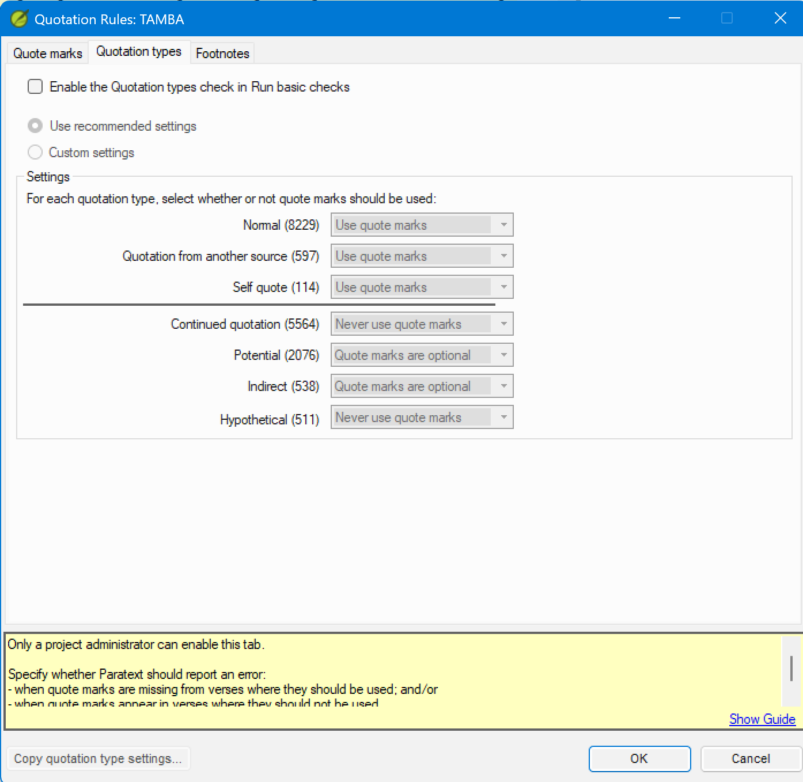

# Lesson 3 — Configuring Quotation Types

**Estimated time:** 60 minutes

> This lesson uses the `tamba` fictional project. See the
> [course README](README.md#the-fictional-project) for its quotation conventions.

**Learning objectives:** By the end of this lesson you will be able to (1) explain what the Quotation types tab controls and why it is separate from the Quote marks tab, (2) configure each of the seven quotation type settings for a given language’s conventions, and (3) distinguish between recommended settings and custom settings.

## Concept

The **Quotation types** tab controls whether Paratext *expects* quotation marks for each semantic category of speech. This is independent of *which characters* are used (that is the Quote marks tab’s job). The Quotation types tab answers: for this type of speech, should marks always appear, never appear, or is either acceptable?

Navigate to: ☰ > Project settings > Quotation Rules > **Quotation types** tab.

### Enabling the check (administrator only)

At the top of the tab is the checkbox **Enable the Quotation types check in Run basic checks**. Only a project administrator can check this box — the status bar confirms: "Only a project administrator can enable this tab." Any user can configure the radio buttons and drop-downs below; it is only the enable checkbox that requires administrator access. If you are not an administrator, configure the settings in this lesson, then ask your project administrator to check the enable box.

> **Limitation:** The Quotation types check only checks first-level quotes in non-Deuterocanonical books.

### The seven quotation types

The tab lists seven types. Each type has a **drop-down** with three active options (plus the default):

- **Use quote marks** — Paratext expects marks to be present; missing marks are flagged as errors.
- **Never use quote marks** — Paratext expects no marks; unexpected marks are flagged as errors.
- **Quote marks are optional** — either is acceptable; the check does not flag errors for this type.

A count in parentheses appears next to each type name showing how many occurrences of that type are in your project scope — useful for gauging how much a given setting will affect your results.

> **Note:** Even if all types are set to Optional, quotes that do not correspond to any recognized quotation type will still be reported.

| Type | Meaning |
| --- | --- |
| Normal | Direct speech between characters in the narrative |
| Quotation from another source | A narrator or character quotes scripture, another text, or a source outside the narrative |
| Self quote | A character quotes their own earlier words |
| Continued quotation | A speech that continues across a paragraph break using a continuation convention |
| Potential | Paratext identifies this as a possible quotation but cannot determine the type |
| Indirect | Reported speech: “He said that the road was long” (no direct marks in the source) |
| Hypothetical | Speech in a conditional or hypothetical frame: “If I were king, I would say…” |

### Recommended settings

When you first open the Quotation types tab, Paratext offers **Recommended settings**. These are sensible defaults for most translations:

| Type | Recommended setting |
| --- | --- |
| Normal | Use quote marks |
| Quotation from another source | Quote marks are optional |
| Self quote | Quote marks are optional |
| Continued quotation | Never use quote marks |
| Potential | Quote marks are optional |
| Indirect | Never use quote marks |
| Hypothetical | Never use quote marks |

If your language follows these conventions, select **Use recommended settings** and you are done. If your language diverges, select **Custom settings** and adjust each type's drop-down individually.

> **Note:** The values Paratext pre-fills under "Use recommended settings" are set by Paratext — verify what appears in your version before relying on the table above as the exact recommended defaults.

> **Tip:** Complete the settings on both the Quote marks tab and the Quotation types tab before clicking **OK** — the OK button saves all changes from both tabs at once.

If another project in your organization uses the same quotation type conventions, click **Copy quotation type settings...** at the bottom of the dialog to import that project's settings rather than configuring each drop-down manually.

> **Visual note:** A dividing line in the dialog separates the first three types (Normal, Quotation from another source, Self quote) from the lower four (Continued quotation, Potential, Indirect, Hypothetical). The upper group covers standard direct speech; the lower group covers special speech categories.

---

### Exercise 3.1 — Reading Tamba’s Quotation Types

Open the Tamba project and navigate to ☰ > Project settings > Quotation Rules > Quotation types tab.

Before changing anything, record the current setting for each type:

| Type | Current setting |
| --- | --- |
| Normal | ? |
| Quotation from another source | ? |
| Self quote | ? |
| Continued quotation | ? |
| Potential | ? |
| Indirect | ? |
| Hypothetical | ? |

Tamba’s settings should match the recommended defaults above. Confirm this before moving on.

---

### Exercise 3.2 — Customizing Quotation Types for Tamba

After reviewing Tamba's text with the translation team, you have determined the following three things:

1. Tamba does not mark narrator scripture citations with quote marks — these appear as plain narrative text.
2. Tamba does not use continuation marks; each paragraph of a long speech closes and reopens.
3. When a character quotes their own earlier words (a self-quote), Tamba treats it the same as any other direct speech: it **must** be marked with quotation marks.

**Step 1** — Confirm that the current recommended settings handle items 1 and 2 correctly:
- Quotation from another source = Quote marks are optional (narrator citations not flagged) ✓
- Continued quotation = Never use quote marks (no continuation marks expected) ✓

**Step 2** — For item 3, check the current recommended setting for **Self quote**. The recommended default is **Quote marks are optional**. Tamba requires marks for self-quotes, so this must change.

Click **Custom settings** at the top of the tab. This switches all drop-downs to editable mode. Change **Self quote** from *Quote marks are optional* to **Use quote marks**.

The correct final settings for Tamba:

| Type | Correct setting for Tamba | Reason |
| --- | --- | --- |
| Normal | Use quote marks | Tamba marks all direct speech |
| Quotation from another source | Quote marks are optional | Narrator scripture citations are not marked |
| Self quote | **Use quote marks** | Tamba treats self-quotes the same as Normal speech |
| Continued quotation | Never use quote marks | Tamba closes and reopens at each paragraph |
| Potential | Quote marks are optional | Uncertain cases should not generate errors |
| Indirect | Never use quote marks | Reported speech is not marked |
| Hypothetical | Never use quote marks | Hypothetical speech is not marked |

**Check your work:**
- Save and re-run the check. A verse with a self-quote that lacks marks should now be flagged as an error.
- Confirm that Luke 4:18 (narrator Isaiah citation) is not flagged — Quotation from another source = Optional means no marks are required.
- Check a verse with indirect speech. With Indirect = Never use quote marks, it should not be flagged.

## Lesson 3 summary
- The Quotation types tab controls whether Paratext *expects* marks for each semantic category of speech — it is separate from and complementary to the character configuration on the Quote marks tab.
- Use recommended settings as a starting point; switch to Custom settings only when the defaults produce incorrect results.
- Configuring quotation types correctly reduces triage work in Lesson 4 by eliminating whole categories of expected exceptions before the check runs.
- Only a project administrator can enable the check in the Run Basic Checks dialog — if you are not an administrator, configure the type settings and ask an administrator to enable the check.

## Check your understanding

1. A language never uses dialogue quote marks for indirect speech (“He said that the road was long”). Which quotation type covers this, and what setting is correct?
2. The recommended settings have “Continued quotation” set to “Never use quote marks”. Your language uses a Quote Continuer at new paragraph — an opening mark repeated at the start of each continued paragraph. Does this conflict with the recommended setting?
3. A check result appears for a narrator OT citation verse. You have “Quotation from another source” set to “Use quote marks”. Is this a real error or a configuration issue? What is the correct action?

**Answers**

1. Indirect speech. Set it to **Never use quote marks** — the check will report an error if marks appear unexpectedly in indirect speech verses, and will not report an error when they are absent.
2. Yes, it conflicts. “Never use quote marks” for Continued quotation means the check expects no marks at the start of a continued paragraph. If your language repeats the opening mark there, the check will flag those marks as errors. Change “Continued quotation” to **Quote marks are optional** or **Use quote marks** depending on how consistently the continuation mark is used.
3. Configuration issue. If Tamba does not mark narrator scripture citations, change “Quotation from another source” to **Quote marks are optional** and re-run — the result will disappear. Fix the configuration rather than editing correct text to silence the check.

---

Previous: [Lesson 2 — Setting Up Quote Marks](02-setting-up-quote-marks.md) · Next: [Lesson 4 — Interpreting and Clearing the Check](04-interpreting-and-clearing-the-check.md)
