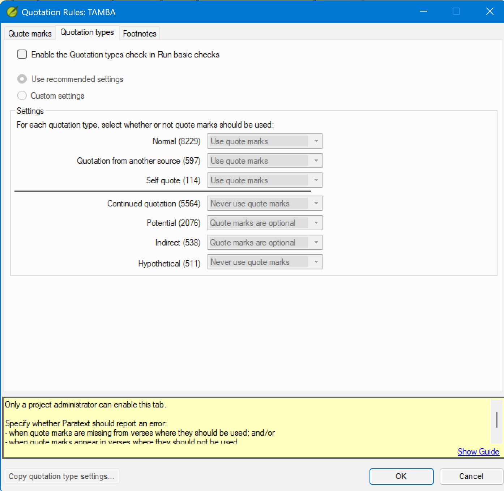

# Lesson 3 — Configuring Quotation Types

**Estimated time:** 60 minutes

> This lesson uses the `tamba` fictional project. See the
> [course README](README.md#the-fictional-project) for its quotation conventions.

**Purpose:** The Quote marks tab from Lesson 2 tells Paratext *which* characters are quote
marks; it does not say *when* marks should appear. On a real project a language may mark
narrator citations one way and self-quotes another. This lesson gives the check its second
input — the rules that decide, per kind of speech, whether marks are expected — so it stops
flagging correct text and starts catching real omissions.

## Learning objectives

By the end of this lesson you will be able to:

- Explain what the Quotation types tab controls and why it is separate from the Quote marks
  tab.
- Configure each of the seven quotation type settings for a given language's conventions.
- Distinguish between recommended settings and custom settings.

## Connect

You have told Paratext which characters are quote marks. But knowing the characters is not the
same as knowing *when they should be there*.

**✏️ Reflection.** Think about the language you support (or Scripture in a language you know
well):

- When the narrator quotes the Old Testament, does that citation get dialogue quote marks, or
  is it left as plain text?
- When the text reports speech indirectly — "He said that the road was long" — should quote
  marks appear at all?
- If a checker flagged *every* indirect-speech verse as "missing quotation mark," would that be
  the translation's fault or the check's setup?

Those are exactly the distinctions the Quotation types tab exists to encode. Hold your answers.

## Content

*This is the second half of configuring the check for the **Translation Tools** competency.
Lesson 2 was about characters; this lesson is about expectations. Getting the type settings
right here eliminates whole categories of false positives before you ever begin triage in
Lesson 4.*

The **Quotation types** tab controls whether Paratext *expects* quotation marks for each
semantic category of speech. This is independent of *which characters* are used (that is the
Quote marks tab's job). The Quotation types tab answers: for this type of speech, should marks
always appear, never appear, or is either acceptable?

Navigate to: ☰ > Project settings > Quotation Rules > **Quotation types** tab.

### Enabling the check (administrator only)

At the top of the tab is the checkbox **Enable the Quotation types check in Run basic
checks**. Only a project administrator can check this box — the status bar confirms: "Only a
project administrator can enable this tab." Any user can configure the radio buttons and
drop-downs below; it is only the enable checkbox that requires administrator access. If you are
not an administrator, configure the settings in this lesson, then ask your project
administrator to check the enable box.

**WARNING** The Quotation types check only checks first-level quotes in non-Deuterocanonical
books.

### The seven quotation types

The tab lists seven types. Each type has a **drop-down** with three active options (plus the
default):

- **Use quote marks** — Paratext expects marks to be present; missing marks are flagged as
  errors.
- **Never use quote marks** — Paratext expects no marks; unexpected marks are flagged as
  errors.
- **Quote marks are optional** — either is acceptable; the check does not flag errors for this
  type.

A count in parentheses appears next to each type name showing how many occurrences of that type
are in your project scope — useful for gauging how much a given setting will affect your
results.

**NOTE** Even if all types are set to Optional, quotes that do not correspond to any recognized
quotation type will still be reported.

| Type | Meaning |
| --- | --- |
| Normal | Direct speech between characters in the narrative |
| Quotation from another source | A narrator or character quotes scripture, another text, or a source outside the narrative |
| Self quote | A character quotes their own earlier words |
| Continued quotation | A speech that continues across a paragraph break using a continuation convention |
| Potential | Paratext identifies this as a possible quotation but cannot determine the type |
| Indirect | Reported speech: "He said that the road was long" (no direct marks in the source) |
| Hypothetical | Speech in a conditional or hypothetical frame: "If I were king, I would say…" |

### Recommended settings

When you first open the Quotation types tab, Paratext offers **Recommended settings**. These
are sensible defaults for most translations:

| Type | Recommended setting |
| --- | --- |
| Normal | Use quote marks |
| Quotation from another source | Use quote marks |
| Self quote | Use quote marks |
| Continued quotation | Never use quote marks |
| Potential | Quote marks are optional |
| Indirect | Quote marks are optional |
| Hypothetical | Never use quote marks |

If your language follows these conventions, select **Use recommended settings** and you are
done. If your language diverges, select **Custom settings** and adjust each type's drop-down
individually.

**NOTE** The values Paratext pre-fills under "Use recommended settings" are set by Paratext —
verify what appears in your version before relying on the table above as the exact recommended
defaults. (The table above reflects Paratext 9.5 defaults confirmed on a built `tamba` project;
earlier drafts of this lesson had Quotation from another source and Indirect backwards — both
actually default to a "marks expected/optional" leaning rather than "never," which is why Tamba's
Exercise 3.2 customization list below touches more rows than you might expect.)

**TIP** Complete the settings on both the Quote marks tab and the Quotation types tab before
clicking **OK** — the OK button saves all changes from both tabs at once.

If another project in your organization uses the same quotation type conventions, click **Copy
quotation type settings...** at the bottom of the dialog to import that project's settings
rather than configuring each drop-down manually.

**NOTE** A dividing line in the dialog separates the first three types (Normal, Quotation from
another source, Self quote) from the lower four (Continued quotation, Potential, Indirect,
Hypothetical). The upper group covers standard direct speech; the lower group covers special
speech categories.

**Key takeaways**

- The Quotation types tab controls whether Paratext *expects* marks for each category of
  speech — separate from, and complementary to, the character configuration on the Quote marks
  tab.
- Use recommended settings as a starting point; switch to Custom settings only when the
  defaults produce incorrect results.
- Configuring types correctly reduces triage work in Lesson 4 by eliminating whole categories
  of expected exceptions before the check runs.
- Only a project administrator can enable the check — if you are not one, configure the
  settings and ask an administrator to enable it.

## Challenge

You are configuring the Tamba project's quotation types after a working session with the
translation team. Each exercise produces settings a mentor can check against Tamba's conventions.

### Exercise 3.1 — Read Tamba's current quotation types

Open the Tamba project and navigate to ☰ > Project settings > Quotation Rules > Quotation types
tab.

**✏️** Before changing anything, record the current setting for each type:

| Type | Current setting |
| --- | --- |
| Normal | ? |
| Quotation from another source | ? |
| Self quote | ? |
| Continued quotation | ? |
| Potential | ? |
| Indirect | ? |
| Hypothetical | ? |

Tamba's settings should match the recommended defaults above. Confirm this before moving on.

### Exercise 3.2 — Customize quotation types for Tamba

After reviewing Tamba's text with the translation team, you have determined the following four
things:

1. Tamba does not mark narrator scripture citations with quote marks — these appear as plain
   narrative text.
2. Tamba's First level uses a Quote Continuer at new paragraph: a long First level speech
   repeats the opening mark `“` at the head of each continued paragraph rather than closing and
   reopening. (Second and Third level have no continuer — those close and reopen fully instead,
   so they never produce a "Continued quotation" instance.)
3. When a character quotes their own earlier words (a self-quote), Tamba treats it the same as
   any other direct speech: it **must** be marked with quotation marks.
4. Tamba never marks reported/indirect speech (e.g. "He told them that the harvest was near") —
   no quote marks appear at all.

**Step 1** — Check the current recommended settings against items 1, 2, and 4. None of the three
match Tamba's conventions:
- Quotation from another source = **Use quote marks** by default — Tamba doesn't mark narrator
  citations, so this must change to *Quote marks are optional* (or the check will flag every
  unmarked citation, including Luke 4:18, as a missing quote).
- Continued quotation = **Never use quote marks** by default — Tamba's First level continuer
  means a mark (`“`) is expected at the head of every continued paragraph; "Never use quote
  marks" would flag that expected continuer as an error. This must change to *Use quote marks*.
- Indirect = **Quote marks are optional** by default — that wouldn't flag a translator who
  mistakenly adds marks to reported speech. Since Tamba's convention is that indirect speech is
  *never* marked, set this to *Never use quote marks* so a stray mark there gets caught.

**Step 2** — Check the current recommended setting for **Self quote**. Unlike the other three,
Self quote already defaults to **Use quote marks** — which is exactly what Tamba needs (item 3).
No change required here; confirm it and move on.

Click **Custom settings** at the top of the tab. This switches all drop-downs to editable mode.
Change **Quotation from another source** from *Use quote marks* to **Quote marks are optional**,
change **Continued quotation** from *Never use quote marks* to **Use quote marks**, and change
**Indirect** from *Quote marks are optional* to **Never use quote marks**. Leave **Self quote**
at *Use quote marks* — it was already correct.

The correct final settings for Tamba:

| Type | Correct setting for Tamba | Changed from default? | Reason |
| --- | --- | --- | --- |
| Normal | Use quote marks | No | Tamba marks all direct speech |
| Quotation from another source | **Quote marks are optional** | Yes — default is Use quote marks | Narrator scripture citations are not marked |
| Self quote | Use quote marks | No — already the default | Tamba treats self-quotes the same as Normal speech |
| Continued quotation | **Use quote marks** | Yes — default is Never use quote marks | Tamba's First level continuer means a mark is expected at every continued paragraph |
| Potential | Quote marks are optional | No | Uncertain cases should not generate errors |
| Indirect | **Never use quote marks** | Yes — default is Quote marks are optional | Reported speech is not marked |
| Hypothetical | Never use quote marks | No | Hypothetical speech is not marked |

**Before you re-run:** the Quotation types check itself only runs if a project administrator
has ticked **Enable the Quotation types check in Run basic checks** (see Content section
above). Exercise 1.1 deliberately left this unticked. If it is still unticked, ask your
administrator to enable it now — none of the settings below will affect the check results
until they do.

**Check your work:**
- Save and re-run the check. Phase A's self-quotes are already correctly marked, so leaving
  Self quote at its default produces no *new* flags on `tamba`. (If a self-quote were missing
  its marks, this setting is what would catch it — that's exactly the behavior Exercise 4.1
  exercises in Lesson 4.)
- Confirm that Luke 4:18 (narrator Isaiah citation) is not flagged, now that Quotation from
  another source = Optional means no marks are required there.
- Check a verse with indirect speech and confirm it is not flagged, now that Indirect = Never
  use quote marks matches Tamba's convention of leaving reported speech unmarked. Then confirm
  that a *stray* mark deliberately added to an indirect-speech verse (try it on a scratch copy)
  *is* flagged — that's the difference Optional wouldn't have caught.
- Confirm that Matthew 5:4–7:27 (every paragraph reopening with the First level continuer `“`
  as the sermon runs on) is *not* flagged, now that Continued quotation = Use quote marks
  recognizes the continuer as expected rather than treating it as a stray mark.

**✏️ Produce this (a mentor will review it).** Write one sentence per type explaining *why*
Tamba diverges from (or keeps) the recommended default — three diverge (Quotation from another
source, Continued quotation, Indirect), one keeps the default (Self quote). A mentor will
compare your final settings table to Tamba's conventions.

## Change

**Self-assessment — can you explain it to a colleague?**

1. A language never uses dialogue quote marks for indirect speech ("He said that the road was
   long"). Which quotation type covers this, and what setting is correct?
2. The recommended settings have "Continued quotation" set to "Never use quote marks". Your
   language uses a Quote Continuer at new paragraph — an opening mark repeated at the start of
   each continued paragraph. Does this conflict with the recommended setting?
3. A check result appears for a narrator OT citation verse. You have "Quotation from another
   source" set to "Use quote marks". Is this a real error or a configuration issue? What is the
   correct action?

*You should be able to say:* (1) Indirect speech — set it to **Never use quote marks**: the
check reports an error if marks appear unexpectedly and stays quiet when they are absent. (2)
Yes, it conflicts — "Never use quote marks" expects no marks at the start of a continued
paragraph, so a repeated opening mark would be flagged; change Continued quotation to **Quote
marks are optional** or **Use quote marks** depending on how consistently the continuation mark
is used. (3) A configuration issue — if the language doesn't mark narrator citations, change
"Quotation from another source" to **Quote marks are optional** and re-run; fix the
configuration rather than editing correct text.

**✏️ Take it to your context.** For one real language you support, fill in the seven-type
table with the setting you'd choose for each, and flag any type where the language diverges
from Paratext's recommended default.

**Next step.** You have now given the check both of its inputs — characters (Lesson 2) and
expectations (this lesson). In [Lesson 4](04-interpreting-and-clearing-the-check.md) you put a
configured project to work: reading real results, telling real errors from configuration
problems, and clearing the check to zero.

---

Previous: [Lesson 2 — Setting Up Quote Marks](02-setting-up-quote-marks.md) · Next: [Lesson 4 — Interpreting and Clearing the Check](04-interpreting-and-clearing-the-check.md)
