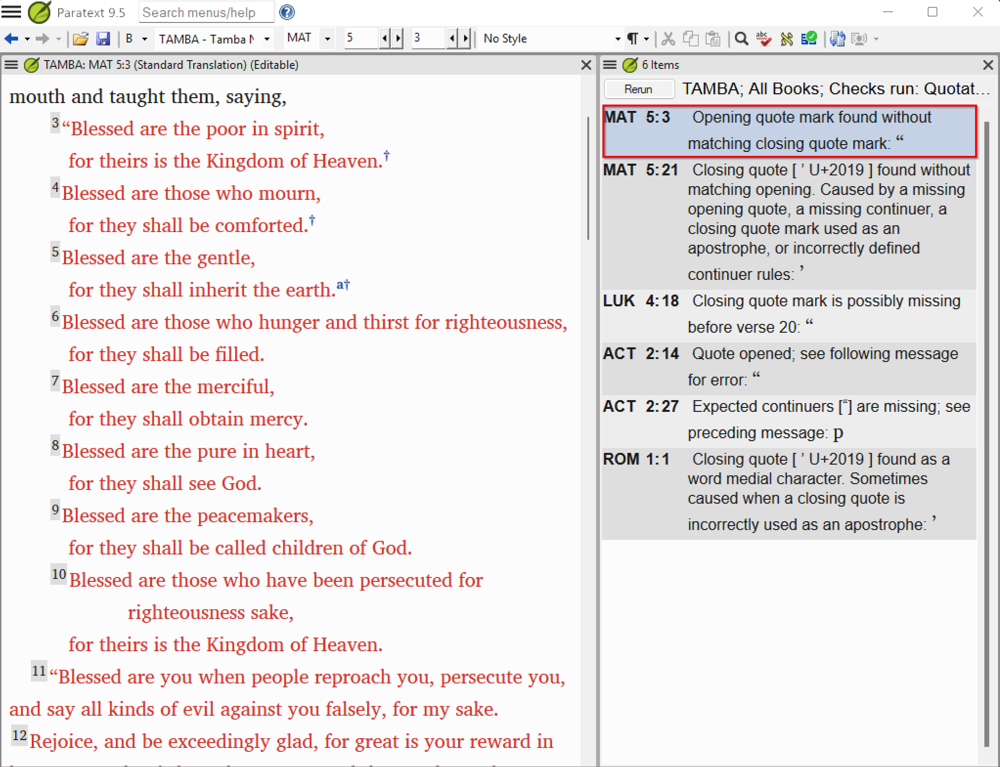

# Lesson 4 — Interpreting and Clearing the Check

**Estimated time:** 75 minutes

> This lesson uses the `tamba` fictional project in **Phase B** (configured, with five
> seeded errors). See the [mentor guide](06-mentor-guide.md) for how the facilitator stages
> Phase B.

**Learning objectives:** By the end of this lesson you will be able to (1) classify a check result as a real error or configuration problem, (2) take the correct corrective action for each type, and (3) work through a result set systematically to reach zero actionable errors.

## Concept

After configuration you will typically have two kinds of results:

1. **Real errors** — a mark is genuinely missing, extra, or at the wrong level. Fix these in the text.
2. **Configuration problems** — the check flags something that reveals a gap in your inventory or rules. Fix these by refining the configuration, not by editing the text.

### Exercise 4.1 — Triage a dirty result set

The `tamba` project has been seeded with the following issues. **Before reading further, fill in the Your prediction column for all five rows — write 1 (Real error) or 2 (Configuration problem).** Only after you have written a prediction for every row should you read the discovery prompts and open the verses.

| # | Location | Check message | Your prediction | Actual type |
|---|----------|--------------|----------------|------------|
| 1 | Matthew 5:3 | Missing closing quotation mark | ? | ? |
| 2 | Luke 4:18 | Unexpected opening quotation mark | ? | ? |
| 3 | John 3:16 | Invalid Second level quotation mark | ? | ? |
| 4 | Acts 2:25 | Unclosed quotation mark at paragraph break | ? | ? |
| 5 | Romans 1:1 | Unexpected closing quotation mark | ? | ? |

**Discovery prompts for each item:**
- Matthew 5:3 opens a speech that runs through verse 5:12. What closing mark should appear at 5:12, and what does the check report when it is absent?
- Luke 4:18 contains an Isaiah citation. Does Tamba use dialogue marks for narrator scripture citations? If not, what should you do with a stray opening `“` before the citation?
- John 3:16 is inside Jesus's speech to Nicodemus. The inner quotation at this verse is Second level. What character should the Second level opening mark be in Tamba? If you see a straight `"` (U+0022) instead, is that a valid Tamba Second level mark?
- Acts 2:25–28: Peter cites Psalm 16 in Second level marks as one continuous span across several paragraph breaks. Recall the Tamba conventions in The Fictional Project table: what does Tamba do with quotation marks at each new paragraph of continued speech? Does this text follow that convention?
- Romans 1:1 has no dialogue. How could `’` (U+2019) inside a word cause the check to report a quotation problem? What is the correct fix?

**Expected resolution (answer key):**

| # | Actual type | Action |
|---|-------------|--------|
| 1 | Real error | Add the missing `”` (U+201D) at the end of Matthew 5:12. The First level speech opened with `“` (U+201C) at verse 5:3; the closing mark was deleted. |
| 2 | Real error | Delete the stray `“` (U+201C) before the Isaiah citation in Luke 4:18. Tamba does not mark narrator scripture citations; the mark was added by mistake. |
| 3 | Real error | The Second level opening mark in John 3:16 is a straight `"` (U+0022) rather than `‘` (U+2018). Replace it with `‘` (U+2018) and confirm the closing `’` (U+2019) is also present. |
| 4 | Real error | Tamba restarts quotation marks at every paragraph break, but the Psalm 16 citation runs from 2:25 to 2:28 as one unbroken Second level span. Edit the text: close with `’` (U+2019) at the end of each paragraph and reopen with `‘` (U+2018) at the start of the next, so every paragraph carries a complete pair. |
| 5 | Configuration problem | The `’` (U+2019) in Romans 1:1 is an apostrophe inside a word, which Paratext reads as the Second level closing mark with no matching opener. Navigate to ☰ > Project settings > Language Settings > Other Characters tab and add `’` (U+2019) to the Word-medial punctuation field. |

### Exercise 4.2 — Reach zero actionable errors

**Goal:** Work through the full result list for the `tamba` project until every result has been cleared by fixing the text or adjusting the configuration.

**Steps:**
1. Limit the scope to Matthew first. Work that book to zero results before expanding.
2. Work through the results top-to-bottom.
3. For each result: open the verse, classify it, take the appropriate action.
   - **Real error:** edit the verse text to fix the mark, then re-run.
   - **Configuration problem:** adjust the Quote marks tab or Quotation types tab, then re-run. Do not edit the text to make marks disappear — fix the configuration instead.
4. After fixing a batch of real errors, re-run the check to confirm the count drops.
5. Once Matthew is clean, expand the scope one book at a time through the NT.
6. When unsure whether a result is a real error or a configuration problem, look at how often the same message appears: the same message repeated across many verses usually points to a configuration gap; a one-off result usually points to a real error in that verse.

**Completion criteria:**
- The Quotations check shows 0 results for the current scope.

## Lesson 4 summary
- Every result is one of two types: real error (fix the text) or configuration problem (fix the Quote marks tab or Quotation types tab).
- Work book by book — Matthew first, then expand. A full-NT result list is overwhelming; a single-book list is actionable.

## Check your understanding

1. A result in Luke 22:35 says "Missing closing quotation mark." You open the verse: Jesus is speaking and the speech continues through verse 38, where it closes correctly with the final `”`. What type of result is this, and what should you do?
2. You have cleared all real errors in Matthew but 6 results remain. You have checked the text carefully — the translation is correct. What should you do next?
3. The check shows an unexpected Second level quotation mark in Romans 8:1, a verse with no dialogue. What is the most likely cause and correct action?

**Answers**

1. Configuration problem: check whether there is a paragraph marker (\p) between verses 35 and 38. If so, the check expects either a closing mark at each paragraph break or a Quote Continuer at new paragraph character for First level. Configure the First level Quote Continuer if Tamba carries speech across paragraph boundaries without re-opening marks, or verify the USFM structure has no unexpected paragraph breaks within this speech.
2. These are configuration problems, not text errors. Review each result to identify what rule or setting is missing — for example, a Quotation types setting that does not match how the language uses marks in that context. Adjust the configuration and re-run until those 6 results clear.
3. A stray quotation character has been inserted into the verse text — likely copied accidentally from a source text. Open the verse, locate the stray mark, and delete it. This is a real error (text correction), not a configuration problem.

---

Previous: [Lesson 3 — Configuring Quotation Types](03-configuring-quotation-types.md) · Next: [Scenario Bank — Language Scenario Practice](05-scenario-bank.md)
