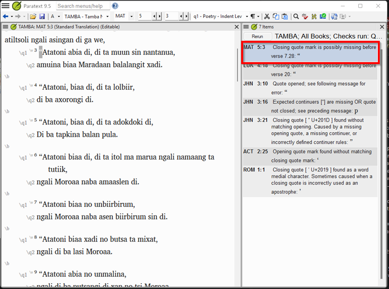
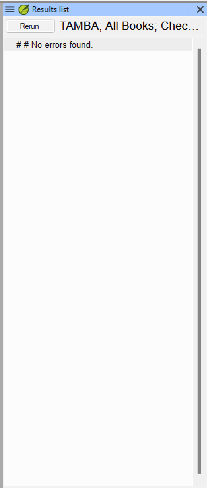

# Lesson 4 — Interpreting and Clearing the Check

**Estimated time:** 75 minutes

> This lesson uses the `tamba` fictional project in **Phase B** (configured, with five
> seeded errors). See the [mentor guide](06-mentor-guide.md) for how the facilitator stages
> Phase B.

**Purpose:** A configured check still produces results — and on a real project the whole value
of your work is being able to look at each one and decide, correctly and quickly, whether to
fix the *text* or fix the *settings*. This lesson is where configuration becomes
troubleshooting: reading results, classifying them, and clearing a book to zero without
silencing correct Scripture.

## Learning objectives

By the end of this lesson you will be able to:

- Classify a check result as a real error or a configuration problem.
- Take the correct corrective action for each type.
- Recognize the rare case where a result is neither — a genuine collision Paratext cannot
  resolve through configuration — and know what to do with it instead.
- Work through a result set systematically to reach zero actionable errors.

## Connect

By now the Tamba project is configured (Lessons 2 and 3). Run the check and you will still see
results — but now they *mean* something. The skill this lesson builds is the judgment call you
will make dozens of times on a real project: **fix the text, or fix the settings?**

**✏️ Reflection.** Think back to the flood of results you saw in Lesson 1, and to a project you
support:

- When a check lights up, what is your first instinct — start editing verses, or step back and
  ask whether the settings are right?
- What would go wrong if you "fixed" a check result by deleting a quotation mark from
  correctly translated text?
- How might you tell, at a glance, whether a batch of similar results is one settings gap or
  many separate text mistakes?

## Content

*This closes the **Translation Tools** "use and troubleshoot" loop: you configured the check,
now you interpret it. The core discipline is never editing correct text just to make a result
disappear — that corrupts the translation to quiet a tool.*

After configuration you will typically have two kinds of results:

1. **Real errors** — a mark is genuinely missing, extra, or at the wrong level. Fix these in
   the text.
2. **Configuration problems** — the check flags something that reveals a gap in your inventory
   or rules. Fix these by refining the configuration, not by editing the text.

**A rare third case:** occasionally a result is neither. When the same character is used as
both a Second (or Third) level closing mark and a word-medial apostrophe, Paratext's
Word-medial punctuation setting (Language Settings > Other Characters) — which looks built for
exactly this — does not actually suppress the resulting "closing quote found as a word medial
character" flag, confirmed against real Paratext 9.5 behavior. There is no text fix (the
apostrophe is correct) and no configuration fix (the setting doesn't take effect once the
character is already a quote mark). The correct action is to verify the flagged instance really
is a genuine apostrophe, then leave it and move on — document it for whoever inherits the
project rather than losing time hunting for a setting that doesn't exist. You'll meet this
exact case in Exercise 4.1, item 5.

The one real fix, when it's available, is upstream of the check entirely: if the language's
orthography is still being finalized, this is worth raising with the translation team as a
reason to pick a different, unique character for the apostrophe — Lesson 2 recommends `ʼ`
(U+02BC MODIFIER LETTER APOSTROPHE), the character Unicode itself designates for an apostrophe
functioning as a letter rather than as punctuation. That eliminates the collision outright
rather than living with documented false positives — but it's a project-level decision for the
team, not a Paratext setting, and it isn't available at all for a fixed text like Tamba's, where
the orthography (real or fictional) is already settled.

Read each result as three parts: the **location** (book, chapter, verse), the **message** (what
the check thinks is wrong), and the **text in context** (open the verse and look). A useful
heuristic: the same message repeated across many verses usually points to a **configuration
gap**; a one-off result usually points to a **real error** in that verse.

**Key takeaways**

- Almost every result is one of two types: real error (fix the text) or configuration problem
  (fix the Quote marks tab or Quotation types tab).
- Never edit correct text to make a result disappear — fix the configuration instead.
- The one confirmed exception: a quote-mark/apostrophe character collision. Neither fix
  applies — verify it's genuine, document it, and move on.
- Work book by book — Matthew first, then expand. A full-NT result list is overwhelming; a
  single-book list is actionable.

## Challenge

The `tamba` project is in **Phase B**: fully configured, but seeded with five deliberate
issues. Your job is to triage them correctly, then clear a book to zero. Your filled-in tables
and reasoning are what a mentor reviews.

### Exercise 4.1 — Triage a dirty result set

The `tamba` project has been seeded with five issues — but the check reports **seven** results,
because one issue (#3) is a single broken mark whose damage is reported back as three separate,
differently-worded results at three different verses. This is common: a break in the middle of a
nested quotation chain confuses the tracking on both sides of the break, so the checker reports
the symptom in multiple places even though there is exactly one thing to fix. **Before reading
further, fill in the Your prediction column for all five rows — write 1 (Real error), 2
(Configuration problem), or 3 (Neither — cannot be resolved through configuration). For row 3,
make one prediction that covers all three linked results.** Only after you have written a
prediction for every row should you read the discovery prompts and open the verses.

| # | Location | Check message | Your prediction | Actual type |
|---|----------|--------------|----------------|------------|
| 1 | Matthew 5:3 | "Closing quote mark is possibly missing before verse 7:28" | ? | ? |
| 2 | Luke 4:18 | "Closing quote mark is possibly missing before verse 20" | ? | ? |
| 3 | John 3:10, 3:16, 3:21 — **one seed, three linked results** | 3:10: "Quote opened; see following message for error" · 3:16: "Expected continuers [“] are missing OR quote not closed; see preceding message" · 3:21: "Closing quote mark [”] found without matching opening" | ? | ? |
| 4 | Acts 2:25 | "Opening quote mark found without matching closing quote mark" | ? | ? |
| 5 | Romans 1:1 | "Closing quote mark [’ U+2019] found as a word medial character. Sometimes caused when a closing quote is incorrectly used as an apostrophe" | ? | ? |

**✏️ Discovery prompts for each item:**
- Matthew 5:3 opens a speech that runs through verse 7:28 — the whole Sermon on the Mount, not
  just the Beatitudes. What closing mark should appear at 7:28, and what does the check report
  when it is absent?
- Luke 4:18 contains an Isaiah citation. Does Tamba use dialogue marks for narrator scripture
  citations? If not, what should you do with a stray opening `“` before the citation? Notice the
  check doesn't call this mark "unexpected" — it just treats it as a legitimate new opening and
  complains that *its* close is missing, wherever the next real closing mark happens to fall.
  What does that tell you about how much the checker actually "knows" about your language's
  conventions?
- John 3:10, 3:16, and 3:21 are three separate results, but open the whole span in one sitting.
  The inner quotation at 3:16 is Second level. What character should the Second level opening
  mark be in Tamba? If you see a straight `"` (U+0022) instead, is that a valid Tamba Second
  level mark? Once you spot the one broken mark, ask yourself: does fixing only that one
  character, then re-running the check, clear all three results, or just one?
- Acts 2:25–28: Peter cites Psalm 16 in Second level marks as one continuous span across
  several paragraph breaks. Recall the Tamba conventions in The Fictional Project table: what
  does Tamba do with quotation marks at each new paragraph of continued speech? Does this text
  follow that convention?
- Romans 1:1 has no dialogue. How could `’` (U+2019) inside a word cause the check to report a
  quotation problem? Try the fix Lesson 2 taught for this exact situation (Word-medial
  punctuation in Language Settings) and re-run the check with a genuinely fresh run, not just
  "Rerun" on the open panel. Does the result actually clear?

**Expected resolution (answer key):**

| # | Actual type | Action |
|---|-------------|--------|
| 1 | Real error | Add the missing `”` (U+201D) at the end of Matthew 7:28. The First level speech opened with `“` (U+201C) at verse 5:3 and runs continuously through the whole Sermon on the Mount; the closing mark at 7:28 was deleted. |
| 2 | Real error | Delete the stray `“` (U+201C) before the Isaiah citation in Luke 4:18. Tamba does not mark narrator scripture citations; the mark was added by mistake. |
| 3 | Real error (one fix, three results) | The Second level opening mark in John 3:16 is a straight `"` (U+0022) rather than `‘` (U+2018). That single wrong character is what produces all three results: the checker reports the true Second level quote as "opened" at 3:10 (where it actually starts), then loses track at 3:16 because the mark there isn't recognized as the expected continuation, then reports an orphaned First-level-looking closing mark at 3:21 that no longer has anything to match against. Replace the one character at 3:16 with `‘` (U+2018), confirm the closing `’` (U+2019) is present at the end of the quotation, re-run the check, and all three results — 3:10, 3:16, and 3:21 — should clear together. Do not chase 3:10 or 3:21 individually; there is nothing wrong at those verses themselves. |
| 4 | Real error | Tamba restarts quotation marks at every paragraph break, but the Psalm 16 citation runs from 2:25 to 2:28 as one unbroken Second level span. Edit the text: close with `’` (U+2019) at the end of each paragraph and reopen with `‘` (U+2018) at the start of the next, so every paragraph carries a complete pair. |
| 5 | Neither — confirmed unresolvable | The `’` (U+2019) in Romans 1:1 is a genuine apostrophe inside a word, which Paratext reads as the Second level closing mark with no matching opener. Adding `’` to ☰ > Project settings > Language Settings > Other Characters > Word-medial punctuation looks like the fix (and is what Lesson 2 teaches), but confirmed against real Paratext 9.5 behavior, it does **not** suppress this result — the check keeps flagging it even after the setting is saved and a fully fresh check is run. There is no text change to make either (the apostrophe is correct as written). Verify the character really is a word-medial apostrophe, then leave the result and move on; note it for anyone else who picks up this project so they don't re-attempt the same fix. |

### Exercise 4.2 — Reach zero *actionable* errors

**Goal:** Work through the full result list for the `tamba` project until every result has
either been cleared (by fixing the text or adjusting the configuration) or, for the one
confirmed unresolvable case, verified and documented as an expected false positive. "Zero
actionable errors" does not mean a literal zero-length results list once Romans is in scope —
it means nothing left in the list still needs your action.

**Steps:**
1. Limit the scope to Matthew first. Work that book to zero results before expanding — Matthew
   has no unresolvable cases, so a true zero is the right target there.
2. Work through the results top-to-bottom.
3. For each result: open the verse, classify it, take the appropriate action.
   - **Real error:** edit the verse text to fix the mark, then re-run.
   - **Configuration problem:** adjust the Quote marks tab or Quotation types tab, then re-run.
     Do not edit the text to make marks disappear — fix the configuration instead.
   - **Neither (confirmed unresolvable):** a quote-mark/apostrophe collision, like Romans 1:1.
     Verify the flagged character is genuinely a word-medial apostrophe, then leave it — do not
     keep trying configuration changes to clear it, and do not edit the text.
4. After fixing a batch of real errors, re-run the check to confirm the count drops.
5. Once Matthew is clean, expand the scope one book at a time through the NT. When you reach
   Romans, expect the count to stop at 1 (the 1:1 apostrophe) rather than reaching 0 — that
   remaining result is correct, not a sign something is still wrong.
6. When unsure whether a result is a real error or a configuration problem, look at how often
   the same message appears: the same message repeated across many verses usually points to a
   configuration gap; a one-off result usually points to a real error in that verse.
7. Watch for **linked results**: a cluster of *different* messages at nearby verses — typically
   an "opened"/"quote opened" message, followed by an "expected continuer" or "not closed"
   message, followed by an orphaned "closing mark found without matching opening" further on —
   usually traces back to one broken mark in the middle of the chain, not three separate errors.
   Fix the one mark, re-run, and confirm the whole cluster clears together before treating any of
   the other verses in the cluster as needing their own fix.

**Completion criteria:**
- The Quotations check shows 0 results for every book except Romans.
- Romans shows exactly 1 result (the 1:1 apostrophe), verified as a genuine word-medial
  apostrophe and documented rather than chased with further configuration changes.

**✏️ Produce this (a mentor will review it).** Submit your completed triage table (predictions
+ actual types) and a one-line note for each result on the action you took and why. The point a
mentor is checking is your *reasoning* — that you fixed text only for real errors and settings
only for configuration problems.

## Change

**Self-assessment — can you explain it to a colleague?**

1. A result in Luke 22:35 says "Missing closing quotation mark." You open the verse: Jesus is
   speaking and the speech continues through verse 38, where it closes correctly with the final
   `”`. What type of result is this, and what should you do?
2. You have cleared all real errors in Matthew but 6 results remain. You have checked the text
   carefully — the translation is correct. What should you do next?
3. The check shows an unexpected Second level quotation mark in Romans 8:1, a verse with no
   dialogue. What is the most likely cause and correct action?

*You should be able to say:* (1) Check whether a paragraph marker (`\p`) sits between verses 35
and 38. If it does, Tamba's First level Quote Continuer (`“`, already configured in Lesson 2)
should appear at the head of that new paragraph — a "Missing closing quotation mark" result on
a speech that legitimately spans the break usually means the continuer character itself is
missing from the text. That makes this a **real error**, not a configuration problem: open the
intervening paragraph(s), confirm each one opens with `“`, and add it wherever it's missing. If
no paragraph break exists between 35 and 38, look instead for an unclosed Second or Third level
quotation nested inside the speech, since Tamba's inner levels close and reopen fully rather
than using a continuer. (2) They are configuration problems, not text errors — review
each to find the missing rule or setting (e.g. a Quotation types setting that doesn't match how
the language uses marks there), adjust, and re-run until they clear. (3) A real error — a stray
quotation character, likely copied from a source text; open the verse, find the stray mark, and
delete it (a text correction, not a configuration change).

**✏️ Take it to your context.** Recall a real check result you (or a translator you support)
have seen. Would you now classify it as a real error or a configuration problem — and what
would you have done differently knowing the two-type distinction?

**Next step.** You have taken one language, Tamba, from an unconfigured check to zero
actionable errors. The [scenario bank](05-scenario-bank.md) puts the full workflow — inventory
→ rules → check → triage — to work on three unfamiliar languages (Velna, Menda, Waku), each
with its own conventions and edge cases.

---

Previous: [Lesson 3 — Configuring Quotation Types](03-configuring-quotation-types.md) · Next: [Scenario Bank — Language Scenario Practice](05-scenario-bank.md)
