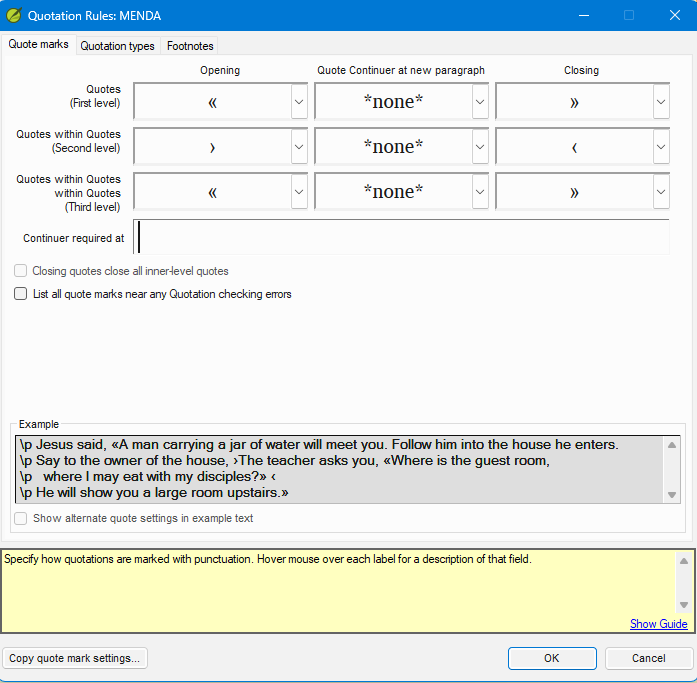

# Scenario Bank — Language Scenario Practice

**Estimated time:** 90 minutes

> Three independent scenarios, roughly 30 minutes each. Scenarios A and B are core practice;
> **Scenario C (Waku em-dash) is an optional stretch** for learners who complete A and B
> confidently. Do them in any order. Each uses its own fictional project — see the
> [mentor guide](06-mentor-guide.md) for how the facilitator distributes them.

**Learning objectives:** By the end of this scenario bank you will be able to apply the complete inventory + rules + check + triage workflow independently to an unfamiliar language scenario, including edge cases not covered in Lessons 1–4.

These exercises use three new fictional projects. Each has a different quotation style. For each scenario follow the same standard workflow:

1. Read the language conventions table.
2. Answer the discovery prompts before configuring anything.
3. Open the Quote marks tab; the fields will be empty.
4. Enter the quote mark characters on the Quote marks tab.
5. Configure the Quotation types tab.
6. Run the check (start with one book).
7. Triage the results to zero actionable errors.
8. Compare your configuration against the expected answer key.

---

## Scenario A — Guillemet (French style)

**Project:** Runda New Testament (`runda`)

**Runda quotation conventions:**

| Level | Opening | Unicode | Closing | Unicode |
|-------|---------|---------|---------|----------|
| First level | `«` | U+00AB | `»` | U+00BB |
| Second level | `‘` | U+2018 | `’` | U+2019 |

No Third level. First level opening mark `«` also appears at the start of continued paragraphs.

**Discovery prompts:**
- Runda uses `’` (U+2019) as both its Second level closing mark and as an apostrophe. How does the Word-medial punctuation setting resolve this conflict?
- How would you verify that the text contains `«` (U+00AB) rather than `<<` (two less-than signs)?

**Expected configuration:**

| Level | Opening | Quote Continuer at new paragraph | Closing |
|-------|---------|----------------------------------|----------|
| First level | `«` | `«` | `»` |
| Second level | `‘` | *(blank)* | `’` |

Word-medial punctuation: add `’` (U+2019) in ☰ > Project settings > Language Settings > Other Characters tab > Word-medial punctuation.

**Check your work:**
- After configuration, run the check on Luke. Verify that `«...»` speech boundaries are recognized correctly and narrative passages generate no results.
- Verify that apostrophes inside words (contractions, possessives) do not appear in the results. If they do, the Word-medial punctuation setting for U+2019 is missing.
- Confirm the First level Quote Continuer (`«`) at the start of continued paragraphs is not flagged as an unexpected mark.

---

## Scenario B — Angle-bracket guillemets (French/German style with nesting reversal)

**Project:** Menda New Testament (`menda`)

**Menda quotation conventions:**

| Level | Opening | Unicode | Closing | Unicode |
|-------|---------|---------|---------|---------|
| First level | `«` | U+00AB | `»` | U+00BB |
| Second level | `›` | U+203A | `‹` | U+2039 |
| Third level | `«` | U+00AB | `»` | U+00BB |

Note: At Second level Menda uses **single guillemets in reversed order** — the `›` (U+203A, right-pointing) opens the embedded speech and `‹` (U+2039, left-pointing) closes it. This is unusual and easy to get wrong.

At Third level Menda returns to **double guillemets** — `«` opens and `»` closes, the same characters as First level. Third level is rare; John 19:21 is the key example.

**Discovery prompts:**
- Why might it be confusing that the opening mark for Second level is the right-pointing single guillemet? What would happen if you entered it in the Closing field by mistake?
- How would you verify which direction the single guillemet in the text actually points? (Hint: use the dropdown list on each field — hover each character option to read its name in the list.)
- If a verse shows `«Il a dit ‹oui›»` and the check flags Second level as having incorrect marks, what is the most likely cause?
- John 19:21 nests speech three levels deep. What characters does Menda use at the Third level, and what will the check report at 19:21 if the Third level cells are left blank?

**Expected configuration:**

| Level | Opening | Quote Continuer at new paragraph | Closing |
|-------|---------|----------------------------------|--------|
| First level | `«` | *(blank)* | `»` |
| Second level | `›` | *(blank)* | `‹` |
| Third level | `«` | *(blank)* | `»` |

Continuation: none. Apostrophe handling: not needed — Menda's Quote marks tab does not use U+2019, so no Word-medial punctuation setting is required.

**Check your work:**
- Run the check on John (contains clear nested dialogue). Verify that `«...›...‹...»` structures pass without errors.
- If the check fires on every Second level opening mark, the Opening and Closing fields for Second level are likely reversed. Confirm which character is right-pointing (`›`) and which is left-pointing (`‹`).
- After entering Second level, check the Example section at the bottom. If › opens and ‹ closes in the example, you have the correct order. The visual difference between `›` and `‹` is easy to miss — use the Example to confirm before clicking OK.
- John 19:21 contains Menda's rare Third level quotation. Verify it passes once Third level is configured — if 19:21 is flagged, the Third level cells are probably still empty.

---

## Scenario C — Non-standard marks with continuation

**Project:** Waku New Testament (`waku`)

**Waku quotation conventions:**

| Level | Opening | Unicode | Closing | Unicode |
|-------|---------|---------|---------|---------|
| First level | `—` | U+2014 | `—` | U+2014 |
| Second level | `“` | U+201C | `”` | U+201D |

Waku uses an **em dash** (U+2014) for both the opening and closing mark at First level. Multi-paragraph speech does *not* restart the em dash — it uses a **continuation mark** of `—` (another em dash) at the start of each continued paragraph.

**Discovery prompts:**
- When the same character is used for both opening and closing, how does Paratext know which is which? What rule does it rely on?
- Waku uses the em dash as a continuation mark. Should the continuation mark be a different character from the opening mark, or can it be the same character? What happens if they are the same?
- In a language where em dash is also used for parenthetical remarks (not speech), how would you expect the check to behave? Is there a way to address this?

**Expected configuration:**

| Level | Opening | Quote Continuer at new paragraph | Closing |
|-------|---------|----------------------------------|--------|
| First level | `—` | `—` | `—` |
| Second level | `“` | *(blank)* | `”` |

Third level: leave blank (Waku uses only two levels). Continuation: `—` (em dash, same character).

**Note on same-character open/close:** When the same character serves as both opener and closer, Paratext relies on structural context (paragraph markers, verse boundaries, and surrounding text flow) to determine which role the em dash plays. Because this context-based interpretation may not resolve every case unambiguously, human review of flagged em-dash results is always required for Waku.

**Check your work:**
- Run the check on Acts (extended speeches, heavy use of em-dash dialogue). Verify that multi-paragraph speeches with continuation marks do not generate "unclosed quote" errors.
- Check a verse where em dash is used for a parenthetical aside (not speech). Does the check flag it? What is the correct response — fix the text (replace the em dash with different punctuation for the parenthetical), reconfigure if possible, or document in a Project Note for the consultant?
- This scenario will likely leave some results that cannot be eliminated by configuration alone — because Paratext cannot distinguish an em dash used as speech from one used as a parenthetical dash. For these, consider whether the verses can be reworded to use different punctuation for the parenthetical. Where rewording is not feasible, add a Project Note (☰ > Insert > Project note...) to explain the em dash is a parenthetical, not dialogue, so the consultant can verify during review.

## Scenario bank summary
- The same four-step workflow (inventory → rules → check → triage) applies to every language, however unusual its quotation conventions.
- Always verify entered characters using the Example section at the bottom of the Quote marks tab — on unfamiliar languages it is easy to confuse visually similar characters.
- Some languages (like Waku) will always require human review of residual results; zero configuration errors does not always mean zero results.

## Scenario check-your-understanding

1. You enter Second level Opening as `‹` and Second level Closing as `›` for the Menda project, then run the check and find that every Second level opening mark generates a result. The Example section in the Quote marks tab shows the marks in reversed order from what you expect. What went wrong, and what is the fix?
2. In Scenario B you enter Second level as Opening: U+2039, Closing: U+203A (reversed from the correct order). What will the check report?
3. After completing Scenario C (Waku), 8 results remain in the Basic Checks panel — all em dashes used as parenthetical remarks, not speech. Configuration cannot eliminate them. What are your options?

**Answers**

1. The characters were entered in the wrong fields — the left-pointing guillemet (`‹`, U+2039) is in the Opening field when it should be in the Closing field, and vice versa. Swap them: Opening should be `›` (right-pointing, U+203A), Closing should be `‹` (left-pointing, U+2039). Confirm by checking the Example section — the correct order shows `›` as the inner opening and `‹` as the inner closing.
2. The check will fire on every Second level opening mark (treating the right-pointing guillemet as an unexpected closing mark) and on every Second level closing mark (treating the left-pointing guillemet as an unexpected opening mark). The entire Second level configuration will appear as errors.
3. Two options: (1) Rewrite the affected verses to use different punctuation for parenthetical remarks (e.g. brackets or a non-speech dash character), which removes the ambiguity and clears the results. (2) Where rewording is not feasible, add a Project Note (☰ > Insert > Project note...) to each verse explaining the em dash is a parenthetical, not dialogue — so the consultant can verify during review. The Basic Checks panel results will remain; documenting them prevents them from being mistaken for unreviewed errors.

---

## Where to Go from Here

### How the Quotation check fits in the Paratext checking workflow

The Quotation check is one of the **Basic Checks** in Paratext 9.5 (run via **☰ > Tools > Run basic checks...**). Basic Checks are typically run and cleared before a book moves to Consultant Check (CC). A consultant reviewer will re-run the checks during review, so the goal is a configuration that genuinely models the language — not a result list silenced by editing correct text.

The recommended sequence for a book heading toward CC:

1. Run all Basic Checks (Quotations, Characters, Markers, Footnotes, and others).
2. Clear each check to zero results by fixing text errors and refining the configuration.
3. Where a residual result cannot be cleared by configuration (see Scenario C), document it with a Project Note so the consultant can verify it quickly.

The Quotation check does not need to be perfect before work continues, but it must be clean before CC begins.

### Maintaining the configuration over time

Quotation Rules are set once per project and persist across sessions, but they need attention when:

- **New text is added.** Re-run the check after each significant drafting session; new text may introduce new errors.
- **A new translator joins.** Check whether they are typing the correct Unicode characters. Open the Quote marks tab and use the dropdown on each field to confirm the selected character, or check the Example section — if the marks look wrong in the example, a find-and-replace on the new chapters may be needed.
- **A new book is started.** Some books (like Psalms, Proverbs, or Revelation) have different poetry/prose ratios. Re-run the check after completing the first draft to confirm that poetry lines (`\q`, `\q2`) are not generating false quotation results.

### Copying Quotation Rules to another project

If your language has more than one translation project (for example, a study Bible alongside the main translation), you do not need to reconfigure the Quote marks tab from scratch. Paratext 9.5 can copy settings from a base project:

Open **☰ > Project settings > Quotation Rules** on the destination project. At the bottom of the dialog, click **Copy quote mark settings...** and select the already-configured project as the source. Review every field after copying — differences in verse structure or text conventions between the two projects may require adjustments.

### What a well-configured project looks like

A project with correctly configured Quotation Rules will:

- Return zero results in purely narrative passages with no speech.
- Return zero results on apostrophes and possessives.
- Flag only genuine mismatches — missing marks, extra marks, wrong-level marks — in speech sections.
- Have any residual results (where the same character serves two linguistic purposes and configuration cannot distinguish them) documented in Project Notes (☰ > Insert > Project note...) so a consultant reviewer can verify them without asking for clarification.

Reaching that state is what this course has prepared you to do.

---

Previous: [Lesson 4 — Interpreting and Clearing the Check](04-interpreting-and-clearing-the-check.md) · Assessment: [Quiz](07-quiz.md)
