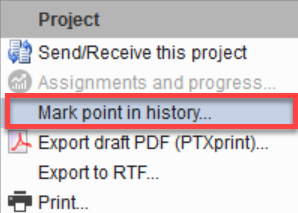
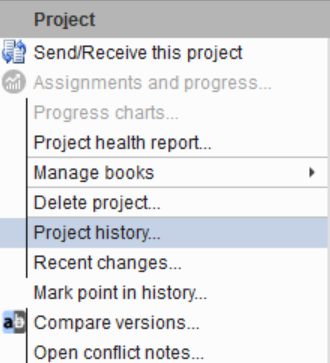
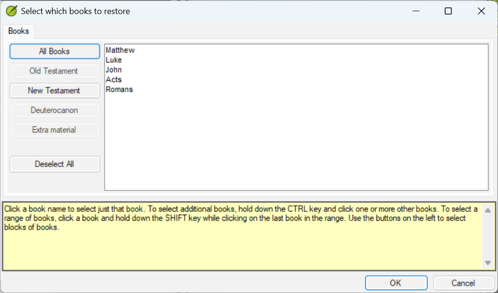

# Mentor Guide — Facilitator Notes

> Facilitator-facing. Read this completely before the first session. It describes how to
> create and distribute the practice projects, how to stage the Tamba project (`TAMBA`, then
> `TAMBAB`) for each phase of the course, and what text content is required. The learner-facing lessons are
> [`01`](01-what-the-quotation-check-does.md)–[`05`](05-scenario-bank.md); the graded
> assessment is the [quiz](07-quiz.md).

## Overview

This course teaches configuration of Paratext 9.5's Quotation check using five practice
projects (`TAMBA`, `RUNDA`, `VELNA`, `MENDA`, `Waku`), plus `TAMBAB`, Tamba's Phase B copy.
Learners never touch a live translation project.

The practice projects use **real languages, adapted for the course**. Each project holds real
Scripture text and keeps its real language setting in Paratext, but carries a course name, and
its quotation marks follow conventions defined by this course. The conventions tables in the
lessons are the course's conventions, not a claim about how that language community writes, so
don't present them to learners as facts about the language. Paratext's project lists show the
real language names:

| Course project | Language setting in Paratext |
|---|---|
| `TAMBA`, `TAMBAB` | Notsi (`ncf`) |
| `RUNDA` | English (`en-US`) |
| `VELNA` | Sursurunga (`sgz`) |
| `MENDA` | English (`en-US`) |
| `Waku` | Nalik (`nal`) |

The Tamba project is used in two staged versions (Phase A blank as `TAMBA`, Phase B seeded as
`TAMBAB`) across Lessons 1–4. `RUNDA` is a second project configured hands-on in Lesson 2,
alongside `TAMBA`, to practice a different character set and the apostrophe conflict. The
remaining three (`VELNA`, `MENDA`, `Waku`) are configured from scratch, independently, in the
[scenario bank](05-scenario-bank.md) — `VELNA` deliberately reuses Runda's guillemet-and-apostrophe
convention under a new name and project, so Scenario A tests the same skill on a project the
learner has not already configured.

---

## Project Setup: `TAMBA`

### Step 1 — Create the project in Paratext 9.5

1. In Paratext, open the main **Paratext** menu (☰ at the top-left of the application window) and click **New project...**
2. Set the following fields:

   | Field | Value |
   |-------|-------|
   | Full name | Tamba New Testament |
   | Short name | TAMBA |
   | Primary language | The real language whose text the project uses: Notsi (`ncf`) for Tamba. Don't create a private-use language code (see Overview). |
   | Versification | Original (or GNT if Original is unavailable) |
   | Project type | Standard |

3. Click **OK**. Paratext creates an empty project.
4. Leave all quotation settings at their defaults for now — learners will configure them in Lessons 2–3.

### Step 2 — Add the minimum required text

The project must contain text in at least the following passages. All other books and chapters can be empty or contain placeholder text.

| Book | Passage | Required because |
|------|---------|------------------|
| Matthew | 5:1–7:29 (the Sermon on the Mount) | Exercise 4.1 seed #1 — multi-paragraph speech. Jesus's First level speech opens with `“` at 5:3, closes with `”` in 5:12, reopens with `“` at the start of 5:13 and closes again with `”` in 7:27; 7:28 (narration) has no quote marks. The whole sermon must be built and correctly continuer-marked through chapter 7, since the check traces the seeded unclosed quote to 7:28 |
| Matthew | 26:1–75 (arrest and trial) | Lesson 3 check verification — heavy dialogue |
| Luke | 4:14–21 | Exercise 4.1 seed #2 — Isaiah citation |
| John | 3:10–21 | Exercise 4.1 seed #3 — First level continuer at the start of 3:16 (its three linked results fall at 3:10, 3:16 and 3:21) |
| Acts | 2:22–28 (Peter's Pentecost speech) | Exercise 4.1 seed #4 — Psalm 16 citation |
| Romans | 1:1–7 | Exercise 4.1 seed #5 — apostrophe-conflict scenario |

For all other books, inserting one or two placeholder verses is sufficient. Note that the unconfigured check in Exercise 1.1 produces no results regardless of text volume — confirmed on a real Paratext 9.5 build, it reports only *"Quotation punctuation is not used in project TAMBA"* until the Quote marks tab is configured; the lesson teaches that notice as the finding. The text volume matters from Lesson 2 onward, when the configured check runs against real dialogue — five or more books with at least a few verses each is sufficient.

### Step 3 — Apply correct Tamba quotation marks throughout

All dialogue in the required passages must use the correct Tamba quotation characters:

| Level | Opening | Quote Continuer at new paragraph | Closing |
|-------|---------|-----------------------------------|----------|
| First level (primary speech) | `“` U+201C | `“` U+201C (same as opening) | `”` U+201D |
| Second level (embedded speech) | `‘` U+2018 | *(blank — no continuer)* | `’` U+2019 |
| Third level (tertiary, rare) | `“` U+201C | *(blank — no continuer)* | `”` U+201D |

**Apostrophes:** Phase A text should contain **no contractions or possessives** — Tamba’s course conventions do not include apostrophes in Phase A, consistent with Exercise 2.3 (which uses Runda as the apostrophe-conflict example, not Tamba). For Phase B, in the text near Romans 1:1 include a word with `’` (U+2019) as an apostrophe — the same character as Tamba’s Second level closing mark. This seeds Exercise 4.1, item 5, which Lesson 4 classifies as **Neither** — a quote-mark/apostrophe collision that neither a text fix nor a configuration change clears.

**Paragraph-spanning speech:** Matthew 5:3–7:27 (the whole Sermon on the Mount) is the key example — not just the Beatitudes. Each verse is its own `\p` paragraph. Jesus's speech opens with `“` (U+201C) at verse 5:3. Because Tamba's First level uses a Quote Continuer, each following paragraph also opens with `“` (U+201C) — the same character, repeated to signal the speech continues from the previous paragraph. The speech closes with `”` (U+201D) in 5:12 and reopens with `“` at the start of 5:13, then closes again with `”` in 7:27. Verse 7:28, the narrator's aside that ends the sermon, carries no quote marks. This is what the learner configures in Exercise 2.1 (Quote marks tab — the continuer character) and Exercise 3.2 (Quotation types tab — Continued quotation = Use quote marks). Lesson 3's Exercise 3.2 ("Check your work") asks the learner to confirm Matthew 5:4–7:27 is not falsely flagged, so the whole span must exist correctly marked in the Phase A baseline from Lesson 3 on. Exercise 4.1 seed #1 also depends on both closing marks (in 5:12 and in 7:27) being present in Phase A, since Phase B deletes both.

**SME verification — confirmed:** a Paratext 9.5 run on a built `TAMBA` project confirmed the Quotation types "Continued quotation" setting does govern whether Paratext expects a configured continuer character at a paragraph break, independent of Second/Third level's close-and-reopen behavior. It also surfaced two behaviors the original design hadn't accounted for, both now reflected in the Lesson 4 Seeding table and Exercise 4.1 below: (1) an unclosed First level quotation is reported at its opening verse with wording that traces forward to wherever the next real closing mark happens to fall, rather than a fixed nearby verse; (2) a single corrupted mark — in seed #3, the First level continuer at a paragraph break — can cascade into multiple linked results on either side of the break rather than one isolated result. Re-verify both if the seeded text is rebuilt from scratch, since exact locations depend on the specific project build.

Do **not** configure the Quote marks tab or Rules at this stage. The project should arrive at learners with a blank quotation configuration.

### Step 4 — Stage two versions of the project

The course requires two states of the Tamba project:

**Phase A — Lessons 1–3 (blank configuration)**
- Quote marks tab: empty
- Quotation Rules: default (unconfigured)
- Text: correct marks, no deliberate errors

Make Phase A available before learners begin Lesson 1 (Step 5). Learners configure the inventory and rules themselves during Lessons 2–3.

**Phase B — Lesson 4 (configured + seeded errors)**
- Quote marks tab: fully configured per the Tamba settings above (Exercise 2.1 values)
- Quotation types tab: recommended defaults with three customizations, confirmed against a real Paratext 9.5 build — Quotation from another source = **Quote marks are optional**, Continued quotation = **Use quote marks**, Indirect = **Never use quote marks** (the Exercise 3.2 result). Self quote already defaults to Use quote marks, which matches Tamba's requirement, so it is left unchanged.
- Text: same as Phase A, plus the five deliberate errors from the Lesson 4 Seeding table below

Phase A and Phase B are two **separate** registered projects: `TAMBA` (Phase A) and `TAMBAB` (Phase B, full name also *Tamba New Testament*). Learners can't see `TAMBAB` until you add them to it, which you do just before Exercise 4.1 (Step 5). Keep `TAMBA` at Phase A at all times: if Phase B content ever reaches `TAMBA`, every learner who receives it for Lessons 1–3 gets the answers.

### Step 5 — Make the projects available through Send/Receive

Learners use Paratext **Send/Receive** only to get the projects. Each learner receives each project once, then works in their own copy on their own computer and never sends. Because nobody sends, the server copy stays at its starting state: any number of learners can work at the same time without overwriting each other, and there is nothing to reset between learners.

You, the mentor, keep the set of backup files and use them once, to set the projects up on the server. Learners only need a backup file if they have no internet connection (see **When Send/Receive isn't an option** below).

**The backup set.** These are prebuilt and verified. Keep them somewhere only mentors can reach: the Phase B backup contains the Lesson 2–3 answers and the configured state of every seed.

| Backup file | Project | State it restores | Needed for |
|---|---|---|---|
| `Tamba New Testament 2026-10-07.zip` | `TAMBA` | **Phase A**: quotation settings blank, Quotation types check off, clean text | Lessons 1–3 |
| `TAMBAB Phase B 2026-10-09.zip` | `TAMBAB` | **Phase B**: Lesson 2–3 settings entered, Quotation types check on, the five seeds in the text | Lesson 4 |
| `Runda New Testament 2026-10-07.zip` | `RUNDA` | Blank | Lesson 2 |
| `Velna New Testament 2026-10-07.zip` | `VELNA` | Blank (Word-medial punctuation empty) | Scenario A |
| `Menda New Testament 2026-10-09.zip` | `MENDA` | Blank | Scenario B |
| `Waku New Testament 2026-10-07.zip` | `Waku` | Blank | Scenario C |

The Phase A and Phase B projects both have the full name *Tamba New Testament*, so Paratext's default backup names for them differ only by date. Keep the Phase B file named `TAMBAB Phase B …`, so it can't be mistaken for the Phase A backup. Restoring the wrong one over `TAMBA` gives every Lesson 1–3 learner the answers.

Each backup already carries the project's Paratext Registry registration (visibility: Test), so restoring one does not create a new project on the Registry.

**One-time setup, in your own Paratext**

1. Restore each project: **Paratext menu > Advanced > Restore project from file...**
2. Send it to the server: **☰ > Send/Receive this project**. This is how the starting state reaches the server.
3. Mark the starting state in its project history (see **Mark the starting state** below).

**For each learner, in your own Paratext**

1. Add the learner to each project they need now. In the project's window, open **☰ > Project settings > User permissions...**, then:
   1. Click **Add User...** and add the learner.
   2. Click **Change Role...** next to the learner's name and choose **Administrator**.
   3. Click **Book Permissions...** and give them **all books**. A new user starts with *Editable Books: None*, even as an Administrator, so don't skip this step. Do it before the learner receives the project.
   4. Click **OK**.

   The learner needs Administrator because Lesson 3 has them tick *Enable the Quotation types check*, and Lesson 2 and the scenarios have them change Language Settings. Those are administrator-only settings.
2. Send the changes to the server: **☰ > Send/Receive this project**. This is how the learner's access reaches the server.

**The learner receives a project** from the main Paratext menu (top left of the Paratext window, not a project window's ☰ menu):

1. **Paratext > Send/Receive projects...**
2. Under **Send/Receive With**, leave **Internet server** selected.
3. The list shows every project the learner has been given access to. A project they don't have on their computer yet is counted under the **New** button above the list. Tick the course project(s) they need now, and click **Send/Receive**. Paratext downloads them.

> **WARNING:** Tell the learner: receive each project once. After that, never Send/Receive it, because their changes would go to every other learner. They save their work instead. The check runs on their own copy, so their work counts without sending it. If Paratext offers to Send/Receive (for example, after a permission change), they cancel it. In testing, when Book Permissions were granted, Paratext offered a Send/Receive; cancelling it was fine and the permission still worked locally.

You add the learner by the user name their copy of Paratext is registered under (**Help > Registration information...**). Get that name from them before you set them up.

**When to make each project available**

| Before… | Project | Mentor | Learner |
|---|---|---|---|
| Lesson 1 | `TAMBA` (Phase A) | Add the learner (as above), then Send/Receive `TAMBA` | Receives `TAMBA` once |
| Lesson 2 | `RUNDA` | Add the learner (as above), then Send/Receive `RUNDA` | Receives `RUNDA` once |
| Lesson 4 | `TAMBAB` (Phase B) | Add the learner to `TAMBAB` (User permissions, as above), then Send/Receive `TAMBAB` | Receives `TAMBAB` once, and works in it, not in `TAMBA`, for Lesson 4 |
| Scenario bank | `VELNA`, `MENDA`, `Waku` | Add the learner (as above), then Send/Receive each | Receives all three once |

`TAMBAB` arrives with the reference Lesson 2–3 configuration already entered, so Lesson 4 starts from a known-good setup whatever the learner entered in `TAMBA`.

**Reviewing Lesson 2–3 work.** Review the learner's Lesson 2–3 settings before they move on to Lesson 4: that's where their own configuration work is. Learners don't send, so you can't see their settings through Send/Receive. Instead, with each lesson's **✏️ Produce this** task they submit screenshots: the **Quote marks** tab for `TAMBA` and `RUNDA` (Lesson 2), and the **Quotation types** tab for `TAMBA` (Lesson 3). Check those against the README convention tables and the Exercise 3.2 settings table.

**Mark the starting state.** Quotation Rules and Language Settings apply to the whole project, and Send/Receive carries any change to everyone who receives afterwards. If a learner sends by mistake, the project history is how you put the server copy back. You can't restore a backup over the project instead: Paratext refuses to load it (*"Waku - Waku New Testament has the same ID as Waku - Waku New Testament and was not loaded."*), and Send/Receive would bring the learner's changes back from the server anyway. So mark the starting state once, as the point to go back to.

**Before the first learner starts**, once each project is set up:

1. In the project window, open **☰ > Project > Mark point in history...**
2. Type a comment you can find again, such as `## Course starting state`, and click **OK**.
3. Send/Receive the project.

> **TIP:** Paratext adds many history entries of its own. Starting your comment with a symbol such as `##` makes your marked point easy to spot in the list later.

**If a learner sends by mistake.** This is a recovery step, not routine: the server copy only leaves its starting state if someone sends. If a learner does Send/Receive a project after working in it, you or the learner put it back to the marked point. In that project:

1. Open **☰ > Project > Project history...**
2. Click your `## Course starting state` entry, then click **Revert Books...**
3. In **Select which books to restore**, click **All Books**, then **OK**.
4. Send/Receive the project.

> **WARNING:** Don't skip **All Books**. Choosing it is what also puts back the Quotation Rules and Language Settings, which is where most of the learner's work is. Without it, the learner's answers stay on the server for the next learner to receive.

> **WARNING:** Reverting has costs. It also wipes the learner's own work since the marked point, so they redo it. And anyone who received the project between the send and the revert keeps the leaked settings.

> **[Placeholder — Kevin/Jenni:** what a learner who received the leaked settings should do (for example, whether they delete their copy and receive again after the revert). Decide and verify this.**]**

Reverting doesn't remove users. That doesn't matter here, because the learner keeps working; if you also want to take them off the project, remove them yourself: **☰ > Project settings > User permissions...**, then **Remove** next to their name.

**When Send/Receive isn't an option.** If a learner has no reliable internet connection, give them the matching backup file to restore on their own computer instead (**Paratext menu > Advanced > Restore project from file...**). Don't hand out the `TAMBAB` backup until they reach Lesson 4.

---

## Project Setup: `RUNDA` (Lesson 2)

`RUNDA` is a second practice project, alongside `TAMBA`, used hands-on in Lesson 2
(Exercises 2.2–2.3) to practice a different character set (guillemets) and to work through the
word-medial apostrophe conflict — including discovering, on a real Paratext 9.5 check, that
Word-medial punctuation does not actually clear the resulting flag. It must be installed before
learners start Lesson 2, not just before the scenario bank.

| Field | Value |
|-------|-------|
| Quotation style | Guillemet outer (`«` / `»`), curly single inner (`‘` / `’`) |
| Minimum books suggested | Matthew, Luke, John (dialogue-heavy) |

Include words using `’` (U+2019) as an apostrophe somewhere in the text, so Exercise 2.3's
word-medial punctuation conflict has real examples to work through — the exercise now expects
learners to confirm the check keeps flagging these even after configuring Word-medial
punctuation, not to reach zero results. Leave the Quote marks tab and
Quotation Rules blank — learners configure both during Lesson 2. The prebuilt backup is in the
mentor's backup set; make it available through Send/Receive as described in Step 5 above.

---

## Project Setup: `VELNA`, `MENDA`, and `Waku` (Scenario bank)

Each scenario-bank project needs enough text to produce meaningful check results, but no deliberate errors need to be seeded — learners configure these projects from scratch, independently, having never seen them before.

| Project | Quotation style | Minimum books suggested |
|---------|----------------|-------------------------|
| `VELNA` | Guillemet outer (`«` / `»`), curly single inner (`‘` / `’`) — Guillemet style (Scenario A). Include words with `’` (U+2019) as apostrophes so learners encounter the apostrophe conflict. | Matthew, Luke, John (dialogue-heavy) |
| `MENDA` | Double guillemets outer, reversed single guillemets inner: `«...›...‹...»`; Third level returns to `«...»` — include at least one third-level quote (John 19:21) (Scenario B) | John (dialogue-heavy, contains the 19:21 third-level example) |
| `Waku` | Em dash as both opener and closer: `—...—`, with em dash continuation mark; Second level `“...”`; Third level `‘...’` (Scenario C) | Matthew, Mark, Luke, John, Acts (stretch exercise; Acts is required — the scenario's check steps use its extended multi-paragraph speeches; Mark 13 carries most of the parenthetical em dashes and John 17 the same-character ambiguity that the scenario's seven residual results depend on) |

Apply the correct quotation characters for each language throughout the text. Leave all Quote marks tab and Rules settings blank — learners configure them as part of the scenario.

Prebuilt backups of all three scenario-bank projects are in the mentor's backup set and are made
available through Send/Receive (see Step 5 under the `TAMBA` setup). The tables above are reference
for anyone rebuilding a project from scratch, not a required setup step. If you do rebuild one: blank the Quote marks tab and Quotation Rules
settings used during verification before backing up — learners must start from empty fields.
`VELNA` is new as of this revision (it replaces `RUNDA`'s prior role in Scenario A, so the two
must be distinct projects — do not reuse the `RUNDA` backup for `VELNA`).

---

## Lesson 4 Seeding

The five underlying issues in Exercise 4.1 must be manually introduced into the Phase B `TAMBAB` project text. Seed each error as follows. Note that seed #3 produces **three** separate check results (at 3:10, 3:16, and 3:21) from one broken mark — confirmed in a Paratext 9.5 run — so the project will show **seven** total results from these five seeds, not five.

| # | Location | What to do in the text |
|---|----------|------------------------|
| 1 | Matthew 5:12, 7:27 | Delete the closing `”` (U+201D) in 5:12 and the closing `”` (U+201D) in 7:27 — leave every opening `“` (U+201C) in place, including the continuers and the `“` that reopens the speech at the start of 5:13. With both closing marks gone, Jesus's speech that opens at 5:3 is never closed, which creates an unclosed-quote result reported back at Matthew 5:3. In practice the check reports this as "Closing quote mark is possibly missing before verse [X]," where `[X]` is wherever the next real closing mark in the project happens to fall — confirmed in a Paratext 9.5 run to trace all the way to 7:28. |
| 2 | Luke 4:18 | Insert a stray `“` (U+201C) immediately before the first word of the Isaiah citation. Tamba does not mark narrator scripture citations; the stray mark mimics a translator adding a dialogue opener by mistake. |
| 3 | John 3:16 | Verse 3:16 begins a new `\p` paragraph inside Jesus's speech to Nicodemus, so in Phase A it opens with the First level Quote Continuer `“` (U+201C). Replace that `“` at the start of 3:16 with a straight `"` (U+0022). This one corrupted character breaks quotation tracking on both sides of it: confirmed in a Paratext 9.5 run to produce three linked results — "Quote opened; see following message for error" at 3:10 (the quotation's true start), "Expected continuers [“] are missing OR quote not closed; see preceding message" at 3:16 (the corrupted mark itself), and "Closing quote mark [”] found without matching opening" at 3:21 (the orphaned close). Replacing the `"` at the start of 3:16 with `“` (U+201C) and re-running clears all three (verified in Paratext 9.5; replacing it with `‘` is not the fix). |
| 4 | Acts 2:28 | Delete the closing `’` (U+2019) in 2:28 that ends Peter's Psalm 16 citation; leave the opening `‘` (U+2018) in 2:25 in place. In Phase A the citation is one Second level span across several paragraph breaks, with no close/reopen at the breaks, and it passes the check clean — Tamba's Second level has no continuer, so the span is valid. Removing only the close leaves the citation unclosed, reported at Acts 2:25; learners identify it as a real error and restore the `’` in 2:28. |
| 5 | Romans 1:1 | In a possessive or contraction in the verse text (e.g., *God’s word*), use `’` (U+2019) as the apostrophe. Phase A text has no apostrophes; this one creates the conflict between the Second level closing mark (U+2019) and a word-medial apostrophe, generating a spurious quotation result. Confirmed on a real Paratext 9.5 build: this result is permanent — adding `’` to Word-medial punctuation does not clear it. Do not seed this expecting learners to reach zero results in Romans; Exercise 4.2's completion criteria account for this one exception. |

After seeding, run the Quotation check and confirm all seven results (five seeds, with #3 producing three) appear before distributing the project to learners. The Exercise 4.1 table already reflects verified Paratext 9.5 message wording for this build; if you rebuild the project from scratch and the wording or locations differ, update that table to match before distributing the course.

---

## General Facilitation Notes

- **Discovery-first ordering:** Each lesson shows the answer key *after* the discovery prompts, not before. Encourage learners to write down their prediction before scrolling to the expected configuration.
- **Scenario C (Waku):** The em-dash scenario is the hardest. It is appropriate as a stretch exercise or for learners who have completed Lessons 1–4 confidently and want a challenge.
