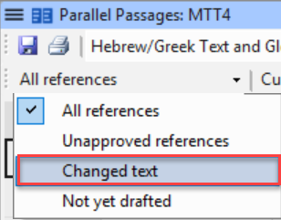
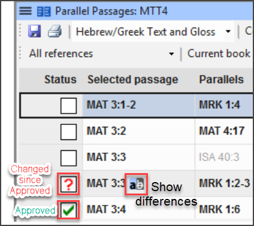
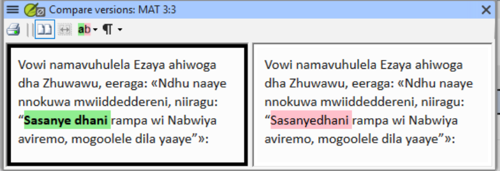

# Lesson 3: Parallel Passages and Measures

**Estimated time:** 60 minutes

**Purpose:** Support a team through two check areas where your role is specifically
*not* to judge the language yourself — confirming that every parallel passage has
actually been reviewed since the last revision, and that any decisions about wording are
the team's own, made against their own agreed approach.

## Learning objectives

You will be able to:
  - Confirm every parallel passage has actually been reviewed since the last revision,
    using the Parallel Passages tool's Status column.
  - Flag any verse pairings still showing a red "?" back to the team for their own
    decision.
  - Recognize the difference between legitimate variation and over-harmonising.

You will be able to:
  - Confirm which numbers/measures check(s) are actually available for the team's
    Paratext version — the new consolidated check, or the older separate Numbers check
    with no working Measures check.
  - Run whichever check is available, checking it against the team's already-agreed
    approach.
  - Route any gaps or contradictions back to the team rather than deciding the correct
    rendering yourself.

## Connect

**✏️ Reflection:** You typically don't speak the language a team is translating into.
Think about what that means for a check like "do these two parallel passages say the
same thing" — what can you actually judge yourself, and what has to stay the team's
call? Keep that boundary in mind through this whole lesson.

## Content

**Why this lesson reframes your role.** Objectives 2 and 5 in this course were
deliberately reframed during SME review: an LTC does not normally have the language
knowledge to judge whether two passages carry the same *meaning*, or whether a number's
rendering is *correct*. Your job in both check areas below is **process and
consistency**, not linguistic judgment: confirm the check ran, confirm the team
reviewed what it found, and route decisions about wording back to the team — never
decide the rendering yourself.

### Parallel passages

Paratext's Parallel Passages tool opens as its own window and displays passages that
should say the same thing (e.g. synoptic Gospel accounts, repeated Old Testament
passages) **side by side**, including the original-language text/gloss for reference.
It does **not** algorithmically detect or flag "inconsistencies" the way a wordlist or
Biblical Terms check does — there is nothing for it to compute. The team looks at each
pair of parallel passages themselves and decides whether the translation is consistent
and acceptable. That judgment call — whether the translation is more harmonized than the
original texts, or less consistent than they are — is the team's from the start, not
something the tool hands you pre-flagged.

**The shading.** The tool shades matching text in every text it shows: the project's
translation as well as the Greek and any resources. Wherever the same three or more
words appear in both parallel passages, they're shaded green, and text that differs is
left unshaded. In the Greek, yellow marks words a biblical scholar has marked by hand
as equivalent — usually a word with a different gloss. That means you can compare the
shading of the Greek with the shading of the translation without reading either one:

- **The Greek is shaded but the translation isn't:** the translation differs where the
  originals agree.
- **The translation is shaded but the Greek isn't:** the translation may be more
  harmonized than the originals.

Either is a pattern to point out to the team. Whether the difference is right is the
team's decision.

*Compare the shading, not the words: Greek, translation and resource are shaded the same way.*

What the tool *does* track is **review status**, per verse, in a **Status column**:

- A **checkmark** means that verse pairing has been reviewed and approved.
- A red **question mark (?)** means the verse has been edited since it was last
  approved and needs to be looked at again.

You can filter the list down to exactly the rows that need attention using the dropdown
above the table:

*Checkmark = reviewed and approved; red "?" = edited since approval, needs another look.*

Clicking the "Show differences" icon on a flagged row opens a side-by-side comparison of
the two verses so you can see exactly what changed:

Your first job is simply to **open the Parallel Passages tool and check the Status
column for outstanding red "?" marks** on the relevant verses — not to assume review
happened because the team says "we already checked that." This is the same "we already
did that" trap from Lesson 1, applied to this specific check: a revision pass can edit a
verse after it was approved, which flips its status back to "needs review" whether or
not the team notices.

Once you can see which verses still show a red "?", your job is to **surface those to
the team**, not to decide whether the passages are consistent yourself. The common
mistake here, per the SME field material, is **over-harmonising**: a team (or an
overzealous checker) makes parallel passages match more closely than the original texts
do. Different biblical authors may relate a story differently, and parallel passages
should not be more harmonized than the original texts. That judgment belongs to the team (and, where
content-level Scripture questions are involved, potentially a Translation Consultant) —
your role is to make sure every verse pairing that shows a red "?" was actually looked
at and given a genuine decision, not left unreviewed or silently over-corrected.

> **WARNING — watch for a false-clean result here too:** A team that says "we already
> checked the parallel passages" may be remembering an earlier pass, before later
> revisions touched those verses. Editing a verse after it was approved turns its
> checkmark back into a red "?" — so open the Parallel Passages tool yourself and look
> at the Status column rather than trusting a team's memory of when it was last done.

### Numbers and Measures — confirm what your team's Paratext version has

Numbers and measures checking in Paratext is changing. A **new, consolidated check** —
covering numbers, weights, and measures together in a single check — is expected to
become available before too long, replacing the older, separate Numbers check (Measures
was never released as its own check, so its functionality is being folded into this new
consolidated one). Whether or not it has shipped by the time you're reading this, the
same underlying skill applies either way: **confirm what a specific team's Paratext
version actually has before you rely on it.** Don't assume every team is on the newer
version at the same time — rollout doesn't happen everywhere at once, and some teams
will stay on an older, unmigrated version for a while yet.

In practice you'll meet one of two situations:

- **The new consolidated check is available.** Confirm it, then run it as one check
  against the team's documented approach to numbers, weights, and measures — you no
  longer need to track two checks of different maturity separately.
- **Only the older, separate Numbers check is available**, with no working Measures
  check at all. This will still be the reality for some teams for a while after the
  consolidated check ships. Numbers has fairly limited scope; treat it the same way as
  any other check area — confirm it was actually run, not assumed clean from an earlier
  pass — and be honest with the team that there's currently no working check that can
  catch weights/measures inconsistencies on their version, so the measure renderings
  are theirs to find and review.

Either way, your role follows the same reframed pattern as parallel passages:

- **Confirm what's actually available and usable** for the team's Paratext version at
  the time of support — don't assume the consolidated check is there just because you've
  seen it elsewhere, and don't assume a team is stuck on the old split checks if their
  version has already moved.
- **Run whichever check is available** against the team's **already-agreed and
  documented approach** to numbers, weights, money, and measures — most teams will have
  made project-level decisions early on (e.g. whether to convert ancient measures to
  modern equivalents, how to render currency) rather than deciding case-by-case.
- When a check surfaces a gap or a contradiction — a rendering that doesn't match the
  team's documented approach, or inconsistency between two occurrences of the same
  measure — **refer it back to the team to resolve**, rather than deciding what the
  correct rendering should be yourself.
- If the team has **no documented approach** for a kind of measurement, that comes
  first: the team agrees and documents its approach before anyone resolves individual
  inconsistencies, because an inconsistency can't be judged without a standard to check
  it against.
- If a team is stuck on the old Numbers-only check, **don't try to compare the measure
  renderings yourself.** It is possible to do some of this by hand, but it isn't easy and
  ambiguous terms will slip past you. Instead, be honest that there's no reliable tool for
  weights and measures on their version yet, and **ask the team to find and review their
  own renderings of weights and measures** against their documented approach. Anything
  inconsistent they turn up stays with them to resolve.
- Numbers (and, once available, the consolidated check) appear as **separate entries**
  in Paratext's Open Biblical Terms List dialog, alongside other unrelated lists (Major
  Biblical Terms, All Biblical Terms, NT Key Biblical Terms, Inclusive/Exclusive
  Pronouns, Younger/Older Siblings, and others) — there is no single combined list to
  point a team at beyond the check itself. Don't assume a project's terminology or
  available lists match what you've seen elsewhere; confirm what's actually present in
  that project's version.

There is still **no confirmed SME field case yet** for a specific numbers/weights/
measures error caught by either version of the check, so this lesson does not invent
one. What *is* established is the shape of your role above — confirm what's available,
run it against the documented approach, and route gaps back to the team.

**Key takeaways**
- In both check areas, your job is process and routing — confirm every relevant item has
  actually been reviewed, and hand judgment calls about wording back to the team.
- The Parallel Passages tool shows passages side by side (with original-language text)
  for the team to judge themselves — it doesn't flag inconsistencies for you. Compare
  the shading of the Greek with the shading of the translation, and check the
  Status column: a checkmark means reviewed and approved, a red "?" means edited
  since approval and needing another look.
- Parallel passages should not be more harmonized than the original texts — watch for
  over-harmonising as the specific failure mode here.
- A new consolidated check (numbers, weights, and measures together) is expected to
  replace the old, separate Numbers check — but not every team will be on a Paratext
  version that has it right away. Confirm what a specific team's version actually offers
  before relying on it, run whichever check is available against the team's own
  documented approach, and route any gap back to the team. Where no reliable measures
  check exists, ask the team to review their measure renderings rather than comparing
  them yourself. There's no established field
  "gotcha" for this area yet, so stay alert rather than assuming a known pattern.

## Challenge

**✏️ Try this:** Five short exercises — recall, two discriminations, and one narrow
tool check. Write each answer, then verify it against the Content section above.

1. **State the standard parallel passages are held to** in one sentence, and name the
   specific failure mode that comes from missing it. Then say who compares the
   translation against that standard, and why it isn't you.
2. **Write the general test** for a legitimate "these should differ" decision: what in
   the tool shows whether two parallel passages *may* differ, and what has to be true
   before a difference counts as *decided*? State it as a test you could apply in any
   project, not as a verdict on one passage. Two or three lines.
3. **Two situations that look alike.** (a) A check, or the team's own review of their
   renderings, turns up an inconsistency between two occurrences of the same
   measurement. (b) There is no documented, agreed approach for
   that kind of measurement at all. Write one line per situation naming your next
   action, then one line on which one you have to settle first when both are true at
   once, and why.
4. **Which check does this team actually have?** Without looking back, describe the two
   situations you might find in a team's Paratext version: the new consolidated check
   covering numbers, weights, and measures together, or the older separate Numbers check
   with no working Measures check. Then open the **Open Biblical Terms List** dialog in
   a project you support and note what's actually present in that version. That dialog
   is where you confirm what a team's Paratext really has, rather than carrying an
   assumption over from another project.
5. **One question, one sentence:** draft the question you'd ask a team to find out
   *where* their agreed approach to numbers, weights, money, and measures is written
   down. This could be a project discussion/note on an individual term, or (more
   likely, given how many terms are typically involved) a single reference document.
   Aim your question at locating whichever actually exists — if your sentence contains
   any hint of what the rendering should be, rewrite it.

## Change

**✏️ Reflection:** Think of a team you support where you don't speak the project
language. Where in your current practice might you have drifted into judging content
rather than confirming process? What would you change about how you phrase your
feedback to keep that boundary clear?

**Next step:** Before your next check-review session, write down one sentence you can
use to hand a content decision back to the team without sounding like you're avoiding
the work — something like "that's a call for your team to make; my job is making sure
the check ran and you've seen everything it found."

**Coming up:** Lesson 4 turns to formatting checks and references — working
structural-first through marker pairs, headings, and the Punctuation Inventory ahead of
typesetting.
